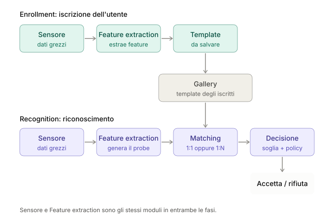
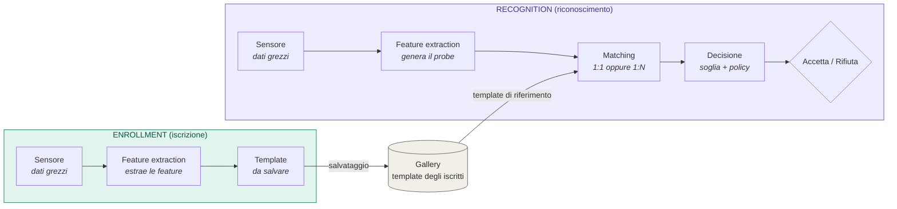

# Introduzione ai Sistemi Biometrici — Riassunto Completo

---

## 1. Cos'è la biometria

Il termine **biometria** deriva dal greco *bios* (vita) e *metron* (misura). In generale indica lo studio e l'uso di metodi per rilevare e misurare le caratteristiche di organismi viventi, traendone classificazioni comparative. In Informatica indica il **riconoscimento o la verifica automatica dell'identità di una persona** sulla base di caratteristiche fisiche o comportamentali. Il Biometric Consortium la definisce come "il riconoscimento automatico di una persona sulla base di caratteristiche discriminative".

Un possibile approccio ai sistemi biometrici è il **pattern recognition**: due pattern sono simili se la distanza tra i loro vettori di feature è piccola. In biometria, le **classi sono gli individui**, e il pattern permette di distinguerli. Le domande centrali del corso, che ritornano in ogni capitolo, sono:
- Qual è una buona misura di distanza?
- Quali sono le feature migliori?
- Qual è il margine di differenza da accettare (soglia)?

Anche assumendo che ogni persona sia unica, restano tre problemi ingegneristici aperti:
1. Determinare le feature uniche in grado di identificare una persona;
2. Trovare tecniche affidabili per misurare tali feature;
3. Ideare algoritmi affidabili per riconoscere/classificare una persona sulla base delle misure ottenute.

L'accesso può essere di due tipi: **fisico** (stanze, edifici, aree) o **logico** (risorse elettroniche, dati critici, login). Il riconoscimento per l'autenticazione può basarsi su:
- **Qualcosa che si possiede** (una carta, un documento) — può essere rubato o copiato: il sistema autentica in realtà l'oggetto, non il proprietario;
- **Qualcosa che si conosce** (una password) — può essere indovinata o dimenticata;
- **Ciò che si è** (le caratteristiche biometriche).

---

## 2. Un po' di storia

- **1882 — Alphonse Bertillon** (capo del servizio identificazione della polizia di Parigi) introduce un sistema di misure corporee pensato per identificare univocamente i criminali, la **Bertillonage**. Raggruppava le persone in 1701 categorie (misure del corpo + colore di occhi e capelli), in modo che ogni nuova scheda dovesse essere confrontata solo con le altre della stessa categoria.
- **1887 — McClaughry** introduce l'antropometria negli Stati Uniti, traducendo il libro di Bertillon.
- **1903** — un caso di scambio di persona basato sulle schede Bertillon ne mette in luce i limiti.
- **Fine '800 — Francis Galton** critica il sistema di Bertillon da un punto di vista statistico. Nel **1892** introduce la nozione di **minuzia** e un primo semplice sistema di classificazione delle impronte digitali.
- **1893** — lo Home Office britannico riconosce che non esistono due individui con le stesse impronte digitali.
- **1900 — classificazione Galton-Henry**: è ancora oggi alla base dei sistemi di riconoscimento delle impronte digitali usati da molti dipartimenti di polizia nel mondo.

> I metodi biometrici non funzionano sempre, ma combinati con i metodi tradizionali possono migliorare il livello di sicurezza.

---

## 3. Architettura di un sistema biometrico

Un sistema biometrico ha due macro-fasi, **enrollment** e **recognition**, che condividono la stessa pipeline di moduli iniziali (acquisizione ed estrazione delle feature) e si differenziano per ciò che avviene a valle.

### 3.1 Panoramica: come si collegano le due fasi

Sensore e Feature Extraction sono **gli stessi moduli** in entrambe le fasi: cambia solo il loro output (template in enrollment, probe in recognition) e il fatto che solo la recognition usa Matching e Decisione.

### 3.2 Le due fasi

**Enrollment (iscrizione).** È la fase in cui l'utente viene registrato nel sistema. I suoi dati biometrici vengono acquisiti ed elaborati per l'uso nelle successive operazioni di autenticazione. Il risultato è un **template** salvato nella **gallery**, l'archivio dei template dei soggetti iscritti.

- Non c'è nessuna decisione da prendere: il flusso termina con la memorizzazione.
- La qualità dell'acquisizione è critica, perché il template resterà in uso per tutte le autenticazioni future. Per questo si acquisiscono spesso più campioni e si scartano quelli di scarsa qualità.

**Recognition (riconoscimento).** È la fase operativa. Il sistema acquisisce nuovamente i dati dell'utente e li elabora con la stessa pipeline dell'enrollment. Il template così ottenuto è il **probe**, cioè il template sottoposto per il riconoscimento. Il probe viene confrontato con i template della gallery e, in base all'esito del matching, il sistema prende una decisione di autenticazione.

Il confronto può avvenire in due modalità:

| Modalità | Domanda a cui risponde | Confronto | Esempio |
|---|---|---|---|
| **Verifica (1:1)** | "Sei chi dichiari di essere?" | Il probe viene confrontato con il solo template associato all'identità dichiarata | Sblocco dello smartphone |
| **Identificazione (1:N)** | "Chi sei?" | Il probe viene confrontato con tutti i template della gallery | Ricerca di una persona in un database |

Nella verifica l'utente fornisce un'identità (badge, PIN, username) e il sistema controlla solo quella. Nell'identificazione non c'è nessuna identità dichiarata e il sistema cerca la corrispondenza migliore tra tutti gli iscritti, quindi il carico computazionale e il rischio di errore crescono con la dimensione della gallery.

### 3.3 Terminologia

| Termine | Significato |
|---|---|
| **Template** | Rappresentazione compatta delle feature estratte da un campione biometrico. Non è il dato grezzo, ma la sua descrizione numerica |
| **Gallery** | Insieme dei template appartenenti ai soggetti iscritti |
| **Probe** | Ogni template sottoposto per il riconoscimento, cioè il campione "da riconoscere" |
| **Matching score** | Valore numerico che misura la similarità (o la distanza) tra probe e template della gallery |
| **Soglia (threshold)** | Valore di riferimento con cui viene confrontato lo score per decidere |

### 3.4 I quattro moduli

Un sistema biometrico è generalmente composto da **quattro moduli**, collegati in cascata:

| Modulo | Funzione | In enrollment | In recognition |
|---|---|---|---|
| **Sensore** | Cattura i dati biometrici grezzi (immagine, audio, segnale) | Acquisisce il campione da iscrivere | Acquisisce il campione da riconoscere |
| **Feature Extraction** | Estrae un insieme di caratteristiche discriminanti dai dati acquisiti, scartando le informazioni irrilevanti | Produce il template da salvare | Produce il probe |
| **Matching** | Confronta le feature estratte con i template salvati, restituendo uno o più matching score | Non utilizzato | Confronta il probe con i template in gallery |
| **Decisione** | Prende una decisione in base ai risultati del matching (soglia + eventuale policy) | Non utilizzata | Accetta o rifiuta |

### 3.5 Come funziona la pipeline, passo per passo

**Flusso di enrollment**

1. Il **sensore** acquisisce il campione biometrico dell'utente.
2. La **feature extraction** elabora il dato grezzo ed estrae le caratteristiche rilevanti.
3. L'output è un **template**, che viene salvato nella **gallery**.

**Flusso di recognition**

1. Il **sensore** acquisisce un nuovo campione dell'utente.
2. La **feature extraction** produce il **probe**.
3. Il **matching** confronta il probe con il template dell'utente (1:1) o con tutti i template della gallery (1:N) e produce uno o più score.
4. La **decisione** applica la soglia e l'eventuale policy: l'utente viene accettato o rifiutato. Nell'identificazione viene restituita l'identità più probabile oppure l'esito "nessuna corrispondenza".

### 3.6 Il ruolo della soglia nella decisione

Due acquisizioni della stessa persona non sono mai identiche (variazioni di posa, illuminazione, rumore, invecchiamento), quindi il matching non cerca l'uguaglianza esatta ma una **similarità sufficiente**. La soglia regola il compromesso tra due tipi di errore:

- **Soglia troppo permissiva**: aumentano i *falsi accetti* (un impostore viene riconosciuto).
- **Soglia troppo restrittiva**: aumentano i *falsi rifiuti* (un utente legittimo viene respinto).

La **policy** può aggiungere regole oltre alla soglia, ad esempio permettere un numero massimo di tentativi o richiedere un secondo fattore di autenticazione.

---

## 4. Classificazione di utenti, contesti e operazioni

### 4.1 Tipi di utente

| Dimensione | Categorie |
|---|---|
| Atteggiamento | **Cooperativo** (interessato al riconoscimento — un impostore qui cerca di essere riconosciuto come utente legale) vs **Non cooperativo** (indifferente o avverso — un impostore qui cerca di evitare il riconoscimento) |
| Popolazione | **Pubblico/Privato** (clienti vs dipendenti dell'ente); **Usato/Non usato** (in base alla frequenza d'uso); **Consapevole/Non consapevole** del processo di riconoscimento |

### 4.2 Tipi di contesto di acquisizione

- **Controllato**: le condizioni di cattura possono essere controllate, le distorsioni evitate, i template difettosi rifiutati e le acquisizioni ripetute.
- **Non controllato/parzialmente controllato**: le condizioni non possono essere controllate, il template può presentare vari livelli di distorsione e, sebbene i template difettosi possano essere rifiutati, l'acquisizione **non può essere ripetuta**.

### 4.3 Tipi di operazione di riconoscimento

- **Verifica (1:1)**:
  - l'utente dichiara un'identità (es. mostrando una carta d'identità o altro),
  - il sistema esegue un matching 1:1 per verificare l'identità dichiarata,
  - risultati possibili: **accetta** o **rifiuta**.
- **Identificazione (1:N)**:
  - nessuna dichiarazione da parte dell'utente,
  - il sistema deve determinare la corrispondenza con uno dei soggetti nella gallery tramite un matching 1:N,
  - risultati possibili: identità riconosciuta o identità non riconosciuta.
  - **Closed set**: tutte le probe appartengono a soggetti iscritti; l'unico errore possibile è restituire l'identità sbagliata.
  - **Open set**: il sistema determina se la probe appartiene a un soggetto nella gallery; alcune probe potrebbero non appartenere a nessun soggetto, quindi il sistema ha un'opzione di rifiuto; errore possibile: rifiutare una probe appartenente a un soggetto iscritto (oltre ad accettare erroneamente uno sconosciuto o restituire l'identità sbagliata).
  - **Watch list**: il sistema ha una lista di soggetti e verifica se la probe appartiene alla lista.
    - **White list**: i soggetti nella lista ottengono l'accesso.
    - **Black list**: i soggetti nella lista vengono rifiutati/segnalati.

> I capitoli su Performance e Reliability costruiscono l'intero vocabolario delle metriche (FAR/FRR, EER, CMC/DIR, …) esattamente su questa tricotomia verifica / closed set / open set — è la base da cui parte tutto il resto del corso.

---

## 5. I requisiti di un buon tratto biometrico

I requisiti fondamentali per un tratto biometrico sono:

1. **Universalità**: il tratto deve essere posseduto da qualunque persona.
2. **Unicità**: ogni coppia di persone dovrebbe risultare diversa secondo il tratto biometrico.
3. **Permanenza**: il tratto biometrico non dovrebbe cambiare nel tempo.
4. **Collectability**: il tratto biometrico deve essere misurabile tramite qualche sensore.
5. **Accettabilità**: le persone coinvolte non devono avere obiezioni a permettere la raccolta/misurazione del tratto.

Un tratto che soddisfa **tutti e cinque** i requisiti è detto **strong/hard biometric trait** (es. iride, impronte digitali, retina, vene di mano/dita, volto). Un tratto a cui manca anche solo uno di questi requisiti — più spesso l'unicità o la permanenza — è un **soft biometric trait** (es. colore dei capelli, altezza, forma del viso, andatura): da solo non basta a identificare univocamente una persona, ma è molto utile come **filtro preliminare economico** per restringere lo spazio di ricerca prima di applicare un tratto più lento ma più forte (cascading — vedi anche il capitolo sui sistemi multibiometrici).

### 5.1 Lo standard ANSI X9.84 (2003)

Lo standard **X9.84-2003** (requisiti minimi di sicurezza per un uso efficace della biometria) riconosce le seguenti tecniche, raggruppate come:

| Categoria | Tratti |
|---|---|
| **Fisiologici** | Impronte digitali, occhio (iride e retina), volto (foto, infrarosso), orecchio, geometria della mano (dita) |
| **Comportamentali** | Firma (statica e dinamica), dinamica di battitura (keystroke) |
| **Misti** | Voce |
| **Tracce biologiche** | DNA |

### 5.2 Tratti genotipici vs randotipici *(concetto ricorrente nella question bank)*

- **Tratti genotipici**: derivano direttamente dal DNA (quasi identici tra parenti/gemelli — es. la forma di base del viso, la geometria della mano).
- **Tratti randotipici**: nascono da processi di sviluppo caotici e non genetici (flusso del liquido amniotico, micro-pressioni) e differiscono anche tra gemelli identici o tra l'occhio destro e sinistro della stessa persona — es. la posizione delle minuzie delle impronte digitali, la texture trabecolare dell'iride, la ramificazione dei vasi retinici/della mano. **I tratti randotipici sono i più discriminativi**, perché sono unici anche al di là della componente genetica.

### 5.3 Biometria comportamentale via wearable (esempio: smartwatch)

Un tratto comportamentale come l'andatura o il gesto del polso può essere catturato da un dispositivo indossabile. Oltre al **giroscopio** (rilevamento della rotazione), sono utili:
- **Accelerometro**: misura l'accelerazione lineare del polso/braccio, catturando pattern personali di movimento (andatura, gesti tipici).
- **Sensore di temperatura**: rileva variazioni termiche tipiche di ciascun individuo.
- **Sensore di battito cardiaco (PPG — fotopletismografia)**: sfrutta la variabilità della frequenza cardiaca (HRV) come ulteriore tratto distintivo.

La combinazione di più sensori rende il riconoscimento comportamentale più stabile e affidabile (si veda anche il concetto di fusione multi-sensore nel capitolo sui sistemi multibiometrici).

---

## 6. Benefici e svantaggi dei tratti biometrici

I tratti biometrici costituiscono una metodologia di autenticazione "naturale", con pro e contro.

**Benefici:**
- Non possono essere persi, prestati, rubati o dimenticati;
- L'utente deve solo presentarsi di persona.

**Svantaggi:**
- Non garantiscono il 100% di accuratezza;
- Alcuni utenti non possono essere riconosciuti da alcune tecnologie (es. lavoratori manuali con impronte digitali danneggiate);
- Alcuni tratti possono cambiare nel tempo (es. il volto, il peso);
- Se un tratto viene "copiato" (spoofing), l'utente non può cambiarlo come farebbe con una password;
- I dispositivi biometrici possono essere inaffidabili in certe condizioni;
- Una foto del volto è più facile da rubare di una password → lo spoofing è un tema di ricerca centrale.
