# Performance dei Sistemi Biometrici — Riassunto Completo

---

## 1. Fonti di errore nei sistemi biometrici

### 1.1 Intra-class variation
Variazioni **all'interno della stessa classe** (stessa persona): posa, espressione, occhiali, illuminazione. L'immagine ideale è frontale, con illuminazione omogenea ed espressione neutra.

### 1.2 Inter-class variation (piccola)
Somiglianza **tra soggetti diversi** (es. gemelli, padre/figlio), che può creare confusione soprattutto in certe condizioni (espressione simile, stessa illuminazione).

### 1.3 Acquisizioni rumorose/distorte
Qualità del campione scarsa (es. impronte di lavoratori manuali, pelle secca). Si possono applicare tecniche di normalizzazione dell'illuminazione.

### 1.4 Non universalità
Una parte della popolazione non può essere riconosciuta da un certo tratto (es. ~4% ha impronte di scarsa qualità).

### 1.5 Attacchi di spoofing (architettura del sistema)
Punti di attacco della pipeline **Sensore → Feature Extractor → Matcher → Stored Templates → Application Device**:
1. Biometria falsa al sensore
2. Replay di dati vecchi
3. Override del feature extractor
4. Vettore di feature sintetico iniettato
5. Override del matcher
6. Modifica dei template salvati
7. Intercettazione del canale
8. Override della decisione finale

### 1.6 Cosa viene confrontato, e come (tipi di template e misure di similarità)

Il matching non avviene mai sui dati grezzi (il **sample**, cioè il dato acquisito dal sensore: un'immagine, una registrazione vocale, una scansione), ma sui **template** — la rappresentazione di feature estratta dal sample. La tecnica di confronto dipende dalla forma del template:

| Tipo di template | Confronto tipico |
|---|---|
| Vettore di valori | Distanza euclidea o cosine similarity |
| Istogramma | Correlazione (di Pearson), oppure distanza di Bhattacharyya |
| Serie temporale (es. accelerometro, andatura) | **Dynamic Time Warping (DTW)** |
| Insieme di punti/triplette (es. minuzie delle impronte $\{(x,y,\theta)\}$) | Point-pattern matching (si cerca l'accoppiamento migliore, poi si misura l'accordo) |
| Embedding di deep learning | Si rimuove l'ultimo layer di classificazione e si confrontano i vettori di embedding risultanti come normali vettori di feature |

Una volta ottenuta una **similarità** (più alta = più simile) o una **distanza** (più bassa = più simile), il valore viene confrontato con una **soglia di accettazione**: tutto il ragionamento sulle soglie è perfettamente simmetrico che si lavori con similarità o con distanze — cambia solo il verso della disuguaglianza.

---

## 3. Verifica (Verification): i 4 possibili esiti

Nella verifica l'utente **dichiara un'identità**; il sistema confronta il campione con il template della gallery corrispondente a quell'identità.

| Esito | Nome | Significato |
|---|---|---|
| Identità vera, accettato | **GA** (Genuine Acceptance / Genuine Match) | Esito positivo |
| Identità vera, rifiutato | **FR** (False Rejection / False Non Match, errore tipo I) | Punteggio insufficiente |
| Identità falsa, rifiutato | **GR** (Genuine Reject / Genuine Non Match) | Esito positivo |
| Identità falsa, accettato | **FA** (False Acceptance / False Match, errore tipo II) | Il più critico in ambito security |

> **FA vs FR:** FA è generalmente il più critico in applicazioni di sicurezza (es. accesso di un impostore), FR crea problemi di usabilità (utenti legittimi bloccati). È un compromesso: non si possono minimizzare entrambi contemporaneamente.

---

## 4. Tassi di errore (Rates)

Le **rate** normalizzano il numero di errori rispetto alla popolazione corretta (non al numero totale di prove), per ottenere una misura indipendente dalla dimensione del probe set.

### 4.1 FAR e FRR — definizione probabilistica

Ipotesi:
- **H₀**: la persona è diversa da quella dichiarata
- **H₁**: la persona è la stessa dichiarata

Decisioni: **D₀** = persone diverse, **D₁** = stessa persona

$$
FAR = P(D_1 \mid H_0 = \text{vero})
$$
$$
FRR = P(D_0 \mid H_1 = \text{vero})
$$

- **FAR** = probabilità di accettare un impostore (calcolata sul numero di **rivendicazioni false**)
- **FRR** = probabilità di rifiutare un utente genuino (calcolata sul numero di **rivendicazioni genuine**)

> **I due scenari di rivendicazione falsa (impostor claim):** una rivendicazione impostore può nascere in due modi, calcolati in modo identico ai fini del FAR: (1) il probe appartiene a qualcuno **non iscritto** in gallery ($P_N$); (2) il probe appartiene a qualcun altro **già iscritto** in gallery, che sta mentendo sulla propria identità. Le rivendicazioni genuine, invece, provengono sempre e solo da $P_G$ (i probe dei soggetti effettivamente iscritti).

> FAR e FRR sono complementari a GAR e GRR: **FRR + GAR = 1**, **FAR + GRR = 1**

### 4.2 Formule esplicite con soglia t

Sia `s(gₓ, pⱼ)` la similarità tra il template gallery gₓ e la probe pⱼ; `id()` restituisce l'identità vera.

**FRR** (calcolato solo sulle rivendicazioni genuine, insieme Pɢ):

$$
FRR(t) = \frac{|\{p_j : s_{xj} \le t,\ id(g_x) = id(p_j)\}|}{|\{p_j : id(g_x) = id(p_j)\}|}
$$

**FAR** (calcolato solo sulle rivendicazioni false):

$$
FAR(t) = \frac{|\{p_j : s_{xj} \ge t \ \wedge\ id(g_x) \ne id(p_j)\}|}{|\{p_j : id(g_x) \ne id(p_j)\}|}
$$

> ⚠️ **Attenzione classica:** FAR e FRR vanno sempre normalizzati rispetto al numero di tentativi genuini/impostori **reali**, non al numero totale di probe. Esempio: 100 probe, 10 FA e 10 FR.
> - Se impostori reali = 10, genuini = 90 → **FRR = 10/90 ≈ 0.11**, **FAR = 10/10 = 1** (!) → tutti gli impostori sono stati accettati!
> - Calcolare erroneamente FAR = FRR = 10/100 nasconde completamente questo problema.

### 4.3 Score genuini e impostori

- **Score genuino (authentic):** confronto tra due campioni della **stessa** persona enrollata.
- **Score impostore:** confronto con il campione di una persona **non enrollata** (o con identità diversa dichiarata).

Le distribuzioni (tipicamente gaussiane) di score genuini e impostori si sovrappongono in parte: in quella zona di intersezione nascono gli errori (FA/FR), a seconda della soglia scelta.

### 4.4 Equal Error Rate (EER)
Punto in cui FAR(t) = FRR(t):

$$
EER = \{x : FRR(t) = x \ \wedge\ FAR(t) = x\}
$$

Non è una soglia, ma il **valore** di errore comune raggiunto a quella soglia.

### 4.5 Altri punti operativi
- **ZeroFAR** (Zero False Match Rate): valore di FRR quando FAR = 0.
- **ZeroFRR** (Zero False Non Match Rate): valore di FAR quando FRR = 0.
- Non è mai possibile avere realmente FAR = 0 o FRR = 0 esatti: sono punti concettuali di riferimento.

```python
# =====================================================================
# 01 — Distribuzioni degli score  (ESEGUIRE PER PRIMO)
# Definisce parametri, funzioni e helper SVG riusati dagli script 02-04.
# =====================================================================
import math, random
from statistics import NormalDist

OUT = '/mnt/user-data/outputs'

# --- parametri (distribuzioni gaussiane degli score) ---
MU_I, SD_I = 0.35, 0.12   # impostori
MU_G, SD_G = 0.65, 0.12   # genuini
T = 0.55                  # soglia di esempio

# --- funzioni condivise ---
pdf = lambda x, m, s: math.exp(-0.5*((x-m)/s)**2)/(s*math.sqrt(2*math.pi))
cdf = lambda x, m, s: 0.5*(1+math.erf((x-m)/(s*math.sqrt(2))))
far = lambda t: 0.5*math.erfc((t-MU_I)/(SD_I*math.sqrt(2)))   # = 1 - cdf, stabile nelle code
frr = lambda t: cdf(t, MU_G, SD_G)
gar = lambda t: 1-frr(t)

FAR, FRR = far(T), frr(T)
GRR, GAR = 1-FAR, 1-FRR
T_EER = (MU_I+MU_G)/2                         # intersezione delle curve (sigma uguali)
EER = far(T_EER)
T_1 = NormalDist(MU_I, SD_I).inv_cdf(0.99)    # soglia con FAR = 1%

# --- colori condivisi ---
C_I, C_G = "#2563eb", "#16a34a"       # impostori / genuini
C_FA, C_FR = "#dc2626", "#f59e0b"     # errori
C_FA_T, C_FR_T, C_G_T = "#b91c1c", "#b45309", "#15803d"   # varianti scure per il testo

# --- helper SVG condivisi ---
def new_svg(W, H):
    return [f'<svg xmlns="http://www.w3.org/2000/svg" viewBox="0 0 {W} {H}" width="{W}" height="{H}" font-family="Helvetica, Arial, sans-serif">',
            f'<rect width="{W}" height="{H}" fill="#ffffff"/>']

def txt(o, x, y, s, size=12, weight=None, fill="#222", anchor="middle", halo=True, extra=""):
    """Testo; con halo=True sotto viene disegnata una copia con contorno bianco
    che separa il testo da linee e curve (funziona in qualsiasi renderer SVG)."""
    w = f' font-weight="{weight}"' if weight else ""
    base = f'x="{x:.1f}" y="{y:.1f}" text-anchor="{anchor}" font-size="{size}"{w}{extra}'
    if halo:
        o.append(f'<text {base} fill="#fff" stroke="#fff" stroke-width="4" stroke-linejoin="round">{s}</text>')
    o.append(f'<text {base} fill="{fill}">{s}</text>')

def header(o, W, title, subtitle):
    txt(o, W/2, 32, title, 20, 700, "#111", halo=False)
    txt(o, W/2, 54, subtitle, 13, None, "#444", halo=False)

def frame(o, L, R, TOP, BOT, xlabel=None, ylabel=None):
    o.append(f'<line x1="{L}" y1="{BOT}" x2="{R}" y2="{BOT}" stroke="#222" stroke-width="1.5"/>')
    o.append(f'<line x1="{L}" y1="{TOP}" x2="{L}" y2="{BOT}" stroke="#222" stroke-width="1.5"/>')
    if xlabel: txt(o, (L+R)/2, BOT+44, xlabel, 13, None, "#222", halo=False)
    if ylabel: o.append(f'<text transform="translate(26,{(TOP+BOT)/2}) rotate(-90)" text-anchor="middle" font-size="13" fill="#222">{ylabel}</text>')

def leader(o, pts, color):
    d = "M " + " L ".join(f"{x:.1f},{y:.1f}" for x, y in pts)
    o.append(f'<path d="{d}" fill="none" stroke="{color}" stroke-width="1.6"/>')
    o.append(f'<circle cx="{pts[-1][0]:.1f}" cy="{pts[-1][1]:.1f}" r="3.2" fill="{color}" stroke="#fff" stroke-width="1"/>')

def save(o, name):
    o.append('</svg>')
    open(f'{OUT}/{name}', 'w', encoding='utf-8').write("\n".join(o))

# --- verifica empirica con campione simulato ---
random.seed(42)
gen = [random.gauss(MU_G, SD_G) for _ in range(10000)]
imp = [random.gauss(MU_I, SD_I) for _ in range(10000)]
print(f"FAR teorico={FAR:.4f} empirico={sum(s>=T for s in imp)/len(imp):.4f} | "
      f"FRR teorico={FRR:.4f} empirico={sum(s<=T for s in gen)/len(gen):.4f}")

# --- punti operativi ---
T_ZFRR = min(gen) - 1e-6    # FRR = 0 sul campione
T_ZFAR = max(imp) + 1e-6    # FAR = 0 sul campione
OPS = [
    (1, "#7c3aed", "Zero FRR", T_ZFRR, "FRR = 0%", f"FAR = {far(T_ZFRR):.1%}"),
    (2, "#db2777", "1% FAR",   T_1,    "FAR = 1%", f"FRR = {frr(T_1):.1%}"),
    (3, "#0f766e", "Zero FAR", T_ZFAR, "FAR = 0%", f"FRR = {frr(T_ZFAR):.1%}"),
]
for n, c, name, t, a, b in OPS:
    print(n, name, round(t, 4), a, b)

# punti evidenziati anche nelle figure ROC e DET (script 03 e 04)
OP_PTS = [(f"t = {T}", T, C_I), (f"EER (t = {T_EER:.2f})", T_EER, "#111111"), ("FAR = 1%", T_1, "#db2777")]

# =====================================================================
# Grafico 1
# =====================================================================
W, H = 920, 710
L, R, TOP, BOT = 70, 880, 105, 455
XMIN, XMAX, YMAX = -0.1, 1.1, 4.4
sx = lambda x: L + (x-XMIN)/(XMAX-XMIN)*(R-L)
sy = lambda y: BOT - y/YMAX*(BOT-TOP)

def curve(m, s, a, b, n=200):
    return [(sx(a+(b-a)*i/n), sy(pdf(a+(b-a)*i/n, m, s))) for i in range(n+1)]
def area(m, s, a, b):
    pts = curve(m, s, a, b)
    return f"M {sx(a):.1f},{BOT} " + " ".join(f"L {x:.1f},{y:.1f}" for x, y in pts) + f" L {sx(b):.1f},{BOT} Z"
def line(m, s):
    return "M " + " L ".join(f"{x:.1f},{y:.1f}" for x, y in curve(m, s, XMIN, XMAX))

o = new_svg(W, H)
header(o, W, "Distribuzioni degli score: genuini vs impostori",
       f"Genuini ~ N({MU_G}, {SD_G}²) · Impostori ~ N({MU_I}, {SD_I}²) · soglia t = {T}")

# aree e curve
o.append(f'<path d="{area(MU_I,SD_I,XMIN,T)}" fill="{C_I}" fill-opacity="0.18"/>')
o.append(f'<path d="{area(MU_G,SD_G,T,XMAX)}" fill="{C_G}" fill-opacity="0.18"/>')
o.append(f'<path d="{area(MU_I,SD_I,T,XMAX)}" fill="{C_FA}" fill-opacity="0.75"/>')
o.append(f'<path d="{area(MU_G,SD_G,XMIN,T)}" fill="{C_FR}" fill-opacity="0.75"/>')
o.append(f'<path d="{line(MU_I,SD_I)}" fill="none" stroke="{C_I}" stroke-width="2.5"/>')
o.append(f'<path d="{line(MU_G,SD_G)}" fill="none" stroke="{C_G}" stroke-width="2.5"/>')

# assi
frame(o, L, R, TOP, BOT, "Score di similarità s", "Densità di probabilità")
for v in [0, 0.2, 0.4, 0.6, 0.8, 1.0]:
    o.append(f'<line x1="{sx(v):.1f}" y1="{BOT}" x2="{sx(v):.1f}" y2="{BOT+5}" stroke="#222"/>')
    txt(o, sx(v), BOT+20, f"{v:.1f}", 12, None, "#333", halo=False)

# soglia
o.append(f'<line x1="{sx(T):.1f}" y1="{TOP+6}" x2="{sx(T):.1f}" y2="{BOT}" stroke="#111" stroke-width="2" stroke-dasharray="7,5"/>')
txt(o, sx(T), TOP-24, f"soglia t = {T}", 14, 700, "#111", halo=False)
txt(o, sx(T)-8, TOP-4, "← rifiuto (D0)", 12, None, "#111", "end", halo=False)
txt(o, sx(T)+8, TOP-4, "accetto (D1) →", 12, None, "#111", "start", halo=False)

# punti operativi
for n, c, name, t, a, b in OPS:
    o.append(f'<line x1="{sx(t):.1f}" y1="{TOP+46}" x2="{sx(t):.1f}" y2="{BOT}" stroke="{c}" stroke-width="2" stroke-dasharray="2,4" stroke-linecap="round"/>')
for n, c, name, t, a, b in OPS:
    o.append(f'<circle cx="{sx(t):.1f}" cy="{TOP+34}" r="10" fill="{c}"/>')
    txt(o, sx(t), TOP+39, str(n), 13, 700, "#fff", halo=False)

# nomi delle distribuzioni
txt(o, sx(MU_I), sy(pdf(MU_I,MU_I,SD_I))-12, "Impostori", 15, 700, C_I)
txt(o, sx(MU_G)+36, sy(pdf(MU_G,MU_G,SD_G))-12, "Genuini", 15, 700, C_G)

# intersezione (tag breve, spiegazione in legenda)
yx = pdf(T_EER, MU_I, SD_I)
o.append(f'<circle cx="{sx(T_EER):.1f}" cy="{sy(yx):.1f}" r="5" fill="#fff" stroke="#111" stroke-width="2"/>')
txt(o, sx(T_EER), sy(yx)-12, "EER", 12, 700, "#111")

# metriche: GRR/GAR dentro le aree grandi; FRR/FAR (aree sottili) con richiamo lungo l'asse
Y_LEAD = BOT-15
xg = sx(0.30)
txt(o, xg, sy(0.95), f"GRR = {GRR:.1%}", 14, 700, C_I)
txt(o, xg, sy(0.95)+15, "impostori", 11.5, None, "#333")
txt(o, xg, sy(0.95)+28, "correttamente rifiutati", 11.5, None, "#333")
xr = (sx(T_1)+sx(T_ZFAR))/2
txt(o, xr, sy(0.80), f"GAR = {GAR:.1%}", 14, 700, C_G_T)
for i, s in enumerate(["genuini", "correttamente", "accettati"]):
    txt(o, xr, sy(0.80)+15+13*i, s, 11.5, None, "#333")
yl = sy(1.45)
txt(o, 88, yl, f"FRR = {FRR:.1%}", 14, 700, C_FR_T, "start")
txt(o, 88, yl+15, "genuini rifiutati", 11.5, None, "#333", "start")
txt(o, 88, yl+28, "(s ≤ t)", 11.5, None, "#333", "start")
leader(o, [(100, yl+36), (100, Y_LEAD), (sx(0.50), Y_LEAD)], C_FR_T)
txt(o, 868, yl, f"FAR = {FAR:.1%}", 14, 700, C_FA_T, "end")
txt(o, 868, yl+15, "impostori accettati", 11.5, None, "#333", "end")
txt(o, 868, yl+28, "(s ≥ t)", 11.5, None, "#333", "end")
leader(o, [(850, yl+36), (850, Y_LEAD), (sx(0.575), Y_LEAD)], C_FA_T)

# legenda
ly = BOT+68
x0 = L
for c, t, op in [(C_FA,"FA – impostore accettato",0.75),(C_FR,"FR – genuino rifiutato",0.75),
                 (C_I,"GRR – impostore rifiutato",0.18),(C_G,"GAR – genuino accettato",0.18)]:
    o.append(f'<rect x="{x0}" y="{ly-11}" width="16" height="16" fill="{c}" fill-opacity="{op}" stroke="{c}"/>')
    txt(o, x0+22, ly+2, t, 12.5, None, "#222", "start", halo=False)
    x0 += 205
o.append(f'<circle cx="{L+8}" cy="{ly+28}" r="5" fill="#fff" stroke="#111" stroke-width="2"/>')
txt(o, L+22, ly+32, f"EER – intersezione delle curve (s = {T_EER:.2f})", 12.5, None, "#222", "start", halo=False)
txt(o, L, ly+56, f"FRR + GAR = 1 ({FRR:.3f} + {GAR:.3f}) · FAR + GRR = 1 ({FAR:.3f} + {GRR:.3f})", 12, None, "#555", "start", halo=False)
ly2 = ly+86
txt(o, L, ly2, f"Punti operativi (soglie alternative a t = {T})", 13, 700, "#111", "start", halo=False)
for i, (n, c, name, t, a, b) in enumerate(OPS):
    yy = ly2 + 24 + i*24
    o.append(f'<circle cx="{L+9}" cy="{yy-4}" r="9" fill="{c}"/>')
    txt(o, L+9, yy, str(n), 12, 700, "#fff", halo=False)
    o.append(f'<text x="{L+28}" y="{yy}" font-size="12.5" fill="#222"><tspan font-weight="700">{name}</tspan>: t = {t:.3f} → {a}, {b}</text>')
txt(o, L, ly2+24+3*24+4, "Zero FRR / Zero FAR: soglie ricavate dal campione simulato (min dei genuini, max degli impostori); 1% FAR: percentile 99 degli impostori.", 11.5, None, "#666", "start", halo=False)
save(o, 'far_frr_distribuzioni.svg')
```

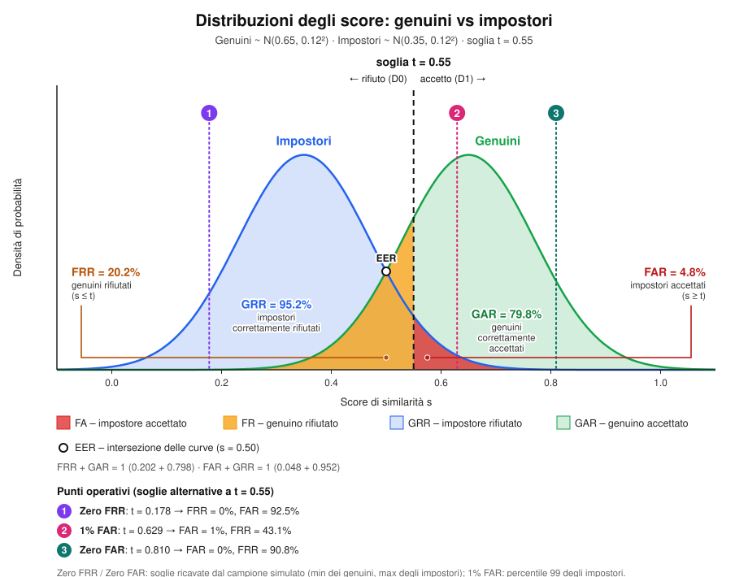

---

## 5. Curve di prestazione (Verifica)

### 5.1 Curva FAR/FRR vs soglia
FAR e FRR hanno **andamento opposto** rispetto alla soglia t: aumentando t (più selettivo), FAR diminuisce e FRR aumenta.

```python
# =====================================================================
# 02 — FAR/FRR vs soglia + margin  (richiede 01_distribuzioni.py)
# Usa: far, frr, T, T_EER, EER, C_FA, C_FR, helper SVG
# =====================================================================
margin = lambda t: abs(far(t)-frr(t))
C_M = "#7c3aed"

W, H = 920, 730
L, R = 80, 880
A_TOP, A_BOT = 95, 400      # pannello A: FAR/FRR
B_TOP, B_BOT = 490, 660     # pannello B: margin
sx = lambda t: L + t*(R-L)
syA = lambda y: A_BOT - y*(A_BOT-A_TOP)
syB = lambda y: B_BOT - y*(B_BOT-B_TOP)
ts = [i/400 for i in range(401)]
path = lambda f, sy: "M " + " L ".join(f"{sx(t):.1f},{sy(f(t)):.1f}" for t in ts)

def grid(o, top, bot):
    for v in [0, 0.25, 0.5, 0.75, 1.0]:
        y = bot - v*(bot-top)
        o.append(f'<line x1="{L}" y1="{y:.1f}" x2="{R}" y2="{y:.1f}" stroke="#e5e7eb"/>')
        txt(o, L-8, y+4, f"{v:.0%}", 12, None, "#333", "end", halo=False)
    for v in [0, 0.2, 0.4, 0.6, 0.8, 1.0]:
        o.append(f'<line x1="{sx(v):.1f}" y1="{bot}" x2="{sx(v):.1f}" y2="{bot+5}" stroke="#222"/>')
        txt(o, sx(v), bot+20, f"{v:.1f}", 12, None, "#333", halo=False)

o = new_svg(W, H)
header(o, W, "FAR e FRR in funzione della soglia t",
       f"Genuini ~ N({MU_G}, {SD_G}²) · Impostori ~ N({MU_I}, {SD_I}²)")

# ---------- pannello A ----------
txt(o, L, A_TOP-14, "A · Tassi di errore", 14, 700, "#111", "start", halo=False)
grid(o, A_TOP, A_BOT)
frame(o, L, R, A_TOP, A_BOT, ylabel="Tasso di errore")
o.append(f'<path d="{path(far, syA)}" fill="none" stroke="{C_FA}" stroke-width="3"/>')
o.append(f'<path d="{path(frr, syA)}" fill="none" stroke="{C_FR}" stroke-width="3"/>')
txt(o, sx(0.30)+8, syA(far(0.30))-9, "FAR(t)", 15, 700, C_FA_T, "start")
txt(o, sx(0.70)-8, syA(frr(0.70))-9, "FRR(t)", 15, 700, C_FR_T, "end")

# soglia di esempio (linea su entrambi i pannelli)
o.append(f'<line x1="{sx(T):.1f}" y1="{A_TOP}" x2="{sx(T):.1f}" y2="{B_BOT}" stroke="#111" stroke-width="1.5" stroke-dasharray="7,5"/>')
txt(o, sx(T)+6, A_TOP+14, f"t = {T}", 12, 700, "#111", "start")
for f, c in ((far, C_FA), (frr, C_FR)):
    o.append(f'<circle cx="{sx(T):.1f}" cy="{syA(f(T)):.1f}" r="5" fill="{c}" stroke="#fff" stroke-width="1.5"/>')
txt(o, sx(T)+12, syA(frr(T))+17, f"FRR = {frr(T):.1%}", 12, 700, C_FR_T, "start")
txt(o, sx(T)+12, syA(far(T))-9, f"FAR = {far(T):.1%}", 12, 700, C_FA_T, "start")

# EER: etichetta nello spazio libero tra le due curve, sopra il punto
yE = syA(EER)
o.append(f'<circle cx="{sx(T_EER):.1f}" cy="{yE:.1f}" r="6" fill="#fff" stroke="#111" stroke-width="2.5"/>')
txt(o, sx(T_EER)-10, yE-62, f"EER = {EER:.1%}", 12.5, 700, "#111")
txt(o, sx(T_EER)-10, yE-48, f"t = {T_EER:.2f}", 11.5, None, "#333")

txt(o, R, A_BOT-24, "t ↑ → più selettivo: FAR ↓, FRR ↑", 12, None, "#555", "end")

# ---------- pannello B ----------
txt(o, L, B_TOP-14, "B · Margin(t) = |FAR(t) − FRR(t)|", 14, 700, "#111", "start", halo=False)
grid(o, B_TOP, B_BOT)
frame(o, L, R, B_TOP, B_BOT, xlabel="Soglia t", ylabel="Margin")
o.append(f'<path d="{path(margin, syB)}" fill="none" stroke="{C_M}" stroke-width="3"/>')
o.append(f'<circle cx="{sx(T_EER):.1f}" cy="{syB(0):.1f}" r="6" fill="#fff" stroke="#111" stroke-width="2.5"/>')
txt(o, sx(T_EER)-20, syB(0)-62, "margin = 0", 12, 700, "#111")
txt(o, sx(T_EER)-20, syB(0)-48, "(soglia EER)", 11.5, None, "#333")
o.append(f'<circle cx="{sx(T):.1f}" cy="{syB(margin(T)):.1f}" r="5" fill="{C_M}" stroke="#fff" stroke-width="1.5"/>')
txt(o, sx(T)+12, syB(margin(T))+17, f"margin({T}) = {margin(T):.1%}", 12, 700, C_M, "start")
save(o, 'far_frr_vs_soglia.svg')
print(f"EER = {EER:.4f} a t = {T_EER}; margin({T}) = {margin(T):.4f}")
```

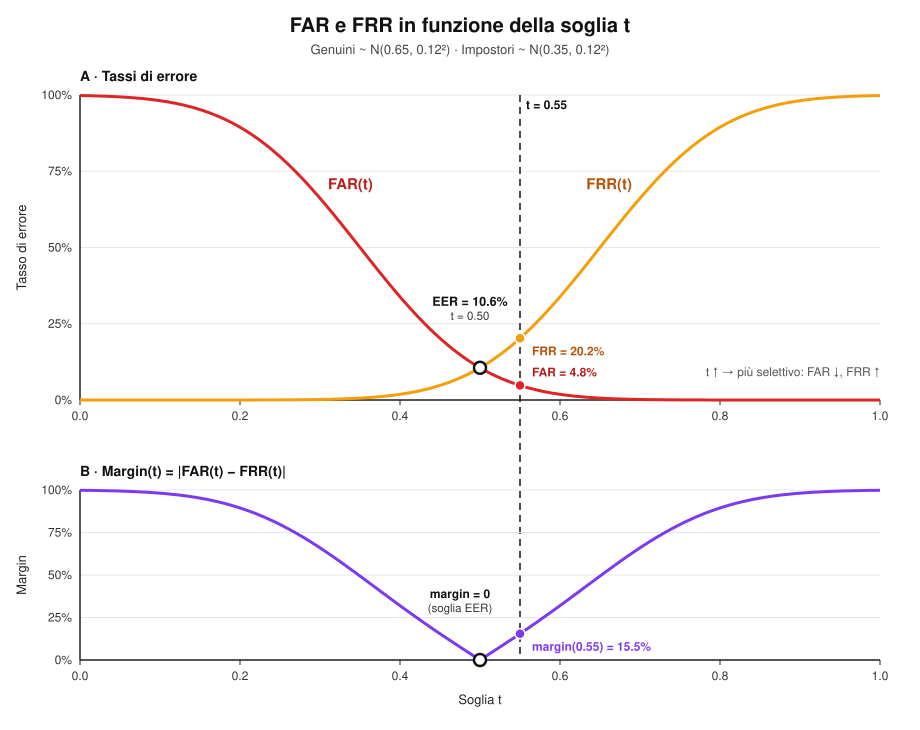

### 5.2 ROC (Receiver Operating Characteristic)
Asse x = FAR, asse y = **1 − FRR** (= GAR). Più la curva è vicina all'angolo in alto a sinistra, migliore è il sistema. Poiché confrontare due curve visivamente può essere ambiguo, si usa una metrica sintetica: l'**AUC (Area Under the Curve)** — l'area sotto la curva ROC. Un'AUC vicina a 1 indica prestazioni eccellenti; un'AUC di 0.5 indica un sistema che si comporta come una scelta casuale (non discriminante).

```python
# =====================================================================
# 03 — Curva ROC con AUC  (richiede 01_distribuzioni.py)
# Usa: far, gar, MU_*, SD_*, OP_PTS, helper SVG
# =====================================================================
ts = [1.3 - 1.8*i/1500 for i in range(1501)]          # t decrescente -> FAR crescente
roc = [(far(t), gar(t)) for t in ts]
auc = sum((roc[i+1][0]-roc[i][0])*(roc[i+1][1]+roc[i][1])/2 for i in range(len(roc)-1))
auc_th = NormalDist().cdf(((MU_G-MU_I)/SD_I)/math.sqrt(2))   # AUC teorica (sigma uguali)
print(f"AUC numerica = {auc:.4f}, teorica = {auc_th:.4f}")

W, H = 780, 800
L, R, TOP, BOT = 95, 715, 85, 705
sx = lambda x: L + x*(R-L)
sy = lambda y: BOT - y*(BOT-TOP)
C_ROC = "#2563eb"

o = new_svg(W, H)
header(o, W, "Curva ROC (Receiver Operating Characteristic)",
       "x = FAR · y = GAR = 1 − FRR · ogni punto corrisponde a una soglia t")

for v in [0, 0.2, 0.4, 0.6, 0.8, 1.0]:
    o.append(f'<line x1="{L}" y1="{sy(v):.1f}" x2="{R}" y2="{sy(v):.1f}" stroke="#e5e7eb"/>')
    o.append(f'<line x1="{sx(v):.1f}" y1="{TOP}" x2="{sx(v):.1f}" y2="{BOT}" stroke="#e5e7eb"/>')
    txt(o, L-8, sy(v)+4, f"{v:.1f}", 12, None, "#333", "end", halo=False)
    txt(o, sx(v), BOT+20, f"{v:.1f}", 12, None, "#333", halo=False)
frame(o, L, R, TOP, BOT, "FAR (False Acceptance Rate)", "GAR = 1 − FRR")

# area AUC, diagonale (sistema casuale), curva
area = f"M {sx(0):.1f},{BOT} " + " ".join(f"L {sx(x):.1f},{sy(y):.1f}" for x, y in roc) + f" L {sx(1):.1f},{BOT} Z"
o.append(f'<path d="{area}" fill="{C_ROC}" fill-opacity="0.12"/>')
o.append(f'<line x1="{sx(0)}" y1="{sy(0)}" x2="{sx(1)}" y2="{sy(1)}" stroke="#6b7280" stroke-width="1.8" stroke-dasharray="6,5"/>')
rx, ry = sx(0.60), sy(0.60)+20
txt(o, rx, ry, "sistema casuale (AUC = 0.5)", 12, None, "#6b7280", "start", extra=f' transform="rotate(-45 {rx:.1f} {ry:.1f})"')
o.append(f'<path d="M {" L ".join(f"{sx(x):.1f},{sy(y):.1f}" for x, y in roc)}" fill="none" stroke="{C_ROC}" stroke-width="3.2"/>')

txt(o, L+14, TOP+22, "↖ migliore", 13, 700, C_G_T, "start")
txt(o, sx(0.55), sy(0.30), f"AUC = {auc:.3f}", 18, 700, "#1d4ed8")
txt(o, sx(0.55), sy(0.30)+18, "area sotto la curva", 12, None, "#333")

# punti operativi: etichette sotto-destra del punto (dentro l'area, lontano dalla curva)
for name, t, c in OP_PTS:
    x, y = far(t), gar(t)
    o.append(f'<circle cx="{sx(x):.1f}" cy="{sy(y):.1f}" r="6.5" fill="{c}" stroke="#fff" stroke-width="2"/>')
    txt(o, sx(x)+14, sy(y)+22, name, 12.5, 700, c, "start")
    txt(o, sx(x)+14, sy(y)+36, f"FAR = {x:.1%}, GAR = {y:.1%}", 11.5, None, "#333", "start")
save(o, 'roc.svg')
```

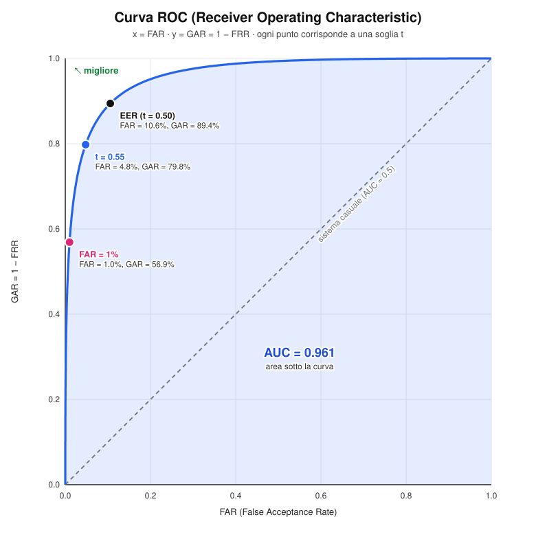

### 5.3 DET (Detection Error Tradeoff)
Asse x = FAR, asse y = FRR (scala logaritmica). Qui **più bassa è la curva, migliore è il sistema** (interpretazione opposta rispetto a ROC).

```python
# =====================================================================
# 04 — Curva DET (scala log)  (richiede 01_distribuzioni.py)
# Usa: far, frr, OP_PTS, helper SVG
# =====================================================================
XMIN, XMAX = 1e-3, 1.0
YMIN, YMAX = 1e-3, 1.0

det = [(far(-0.2+1.4*i/3000), frr(-0.2+1.4*i/3000)) for i in range(3001)]
det = [(x, y) for x, y in det if XMIN <= x <= XMAX and YMIN <= y <= YMAX]

W, H = 780, 800
L, R, TOP, BOT = 95, 715, 85, 705
lg = lambda v, a, b: (math.log10(v)-math.log10(a))/(math.log10(b)-math.log10(a))
sx = lambda x: L + lg(x, XMIN, XMAX)*(R-L)
sy = lambda y: BOT - lg(y, YMIN, YMAX)*(BOT-TOP)

o = new_svg(W, H)
header(o, W, "Curva DET (Detection Error Tradeoff)",
       "x = FAR · y = FRR · scale logaritmiche · più bassa è la curva, migliore è il sistema")

# griglia log
labels = {1e-3: "0.1%", 1e-2: "1%", 1e-1: "10%", 1.0: "100%"}
for e in (-3, -2, -1):
    for k in range(2, 10):
        v = k*10**e
        o.append(f'<line x1="{sx(v):.1f}" y1="{TOP}" x2="{sx(v):.1f}" y2="{BOT}" stroke="#f1f5f9"/>')
        o.append(f'<line x1="{L}" y1="{sy(v):.1f}" x2="{R}" y2="{sy(v):.1f}" stroke="#f1f5f9"/>')
for v, lab in labels.items():
    o.append(f'<line x1="{sx(v):.1f}" y1="{TOP}" x2="{sx(v):.1f}" y2="{BOT}" stroke="#d1d5db"/>')
    o.append(f'<line x1="{L}" y1="{sy(v):.1f}" x2="{R}" y2="{sy(v):.1f}" stroke="#d1d5db"/>')
    txt(o, sx(v), BOT+20, lab, 12, None, "#333", halo=False)
    txt(o, L-8, sy(v)+4, lab, 12, None, "#333", "end", halo=False)
frame(o, L, R, TOP, BOT, "FAR (scala log)", "FRR (scala log)")

# diagonale FAR = FRR e curva
o.append(f'<line x1="{sx(XMIN)}" y1="{sy(YMIN)}" x2="{sx(XMAX)}" y2="{sy(YMAX)}" stroke="#6b7280" stroke-width="1.8" stroke-dasharray="6,5"/>')
dx, dy = sx(0.012), sy(0.012)-8
txt(o, dx, dy, "FAR = FRR", 12, None, "#6b7280", "start", extra=f' transform="rotate(-45 {dx:.1f} {dy:.1f})"')
o.append(f'<path d="M {" L ".join(f"{sx(x):.1f},{sy(y):.1f}" for x, y in det)}" fill="none" stroke="#2563eb" stroke-width="3.2"/>')
txt(o, L+90, BOT-14, "↙ migliore", 13, 700, C_G_T, "start")

# punti operativi: etichette negli spazi liberi (sotto-sinistra della curva; EER nel cuneo a destra)
place = [("end", -14, 22), ("start", 35, -6), ("end", -14, 22)]
for (name, t, c), (anc, ddx, ddy) in zip(OP_PTS, place):
    x, y = far(t), frr(t)
    o.append(f'<circle cx="{sx(x):.1f}" cy="{sy(y):.1f}" r="6.5" fill="{c}" stroke="#fff" stroke-width="2"/>')
    txt(o, sx(x)+ddx, sy(y)+ddy, name, 12.5, 700, c, anc)
    txt(o, sx(x)+ddx, sy(y)+ddy+14, f"FAR = {x:.1%}, FRR = {y:.1%}", 11.5, None, "#333", anc)
save(o, 'det.svg')
```

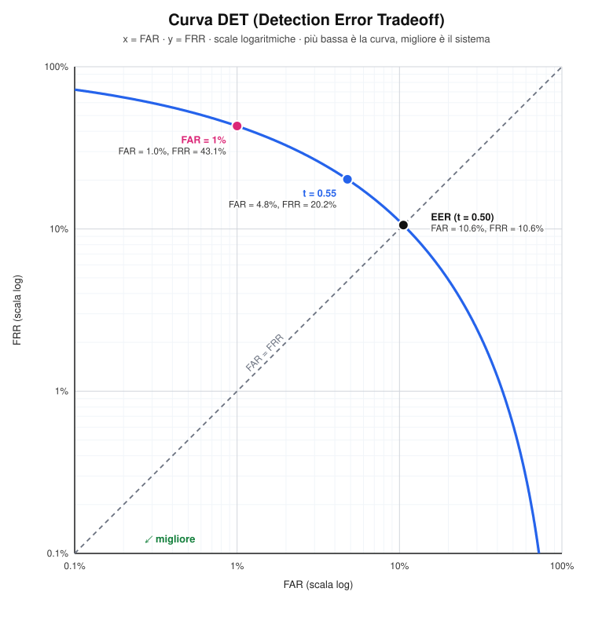

---

## 6. Identificazione Open Set (Watchlist)

A differenza della verifica, **non c'è rivendicazione di identità**: il probe viene confrontato con **tutta** la gallery (1-a-N), e il sistema deve decidere da solo due cose: *se* il soggetto è noto e, in caso affermativo, *chi* è.

### 6.0 Notazione

| Simbolo | Significato |
|---|---|
| $G = \{g_1, \dots, g_N\}$ | Gallery: template delle $N$ identità registrate |
| $id(g_i)$ | Identità associata al template $g_i$ |
| $p_j$ | Probe (campione da identificare) |
| $s_{ij} = sim(p_j, g_i)$ | Punteggio di similarità tra probe $j$ e template $i$ (più alto = più simile) |
| $P_G$ | Insieme dei probe di persone **presenti** in gallery (*genuine*, "noti") |
| $P_N$ | Insieme dei probe di persone **non presenti** in gallery (*impostori*, "ignoti") |
| $t$ | Soglia di accettazione |
| $rank(p_j)$ | Posizione, nella lista dei template ordinata per punteggio decrescente, del template della vera identità di $p_j$ |

### 6.1 Procedura del sistema

Dato un probe $p_j$:

1. **Confronto 1:N**: si calcolano tutti i punteggi $s_{1j}, \dots, s_{Nj}$.
2. **Ordinamento**: si ordinano i template per punteggio decrescente. Il template al rank 1 è $g_{i^*}$ con $i^* = \arg\max_i s_{ij}$.
3. **Test di soglia**: si controlla se $s_{i^*j} \ge t$.
4. **Decisione**:
   - se $s_{i^*j} \ge t$ → il sistema accetta e restituisce l'identità $id(g_{i^*})$;
   - se $s_{i^*j} < t$ → il sistema rifiuta ("soggetto non in watchlist").

Il sistema vede **solo** questo. Se la persona fosse davvero in gallery, o se $id(g_{i^*})$ fosse davvero la sua identità, lo sa solo chi valuta il sistema (ground truth). Gli esiti si definiscono confrontando la decisione con la ground truth.

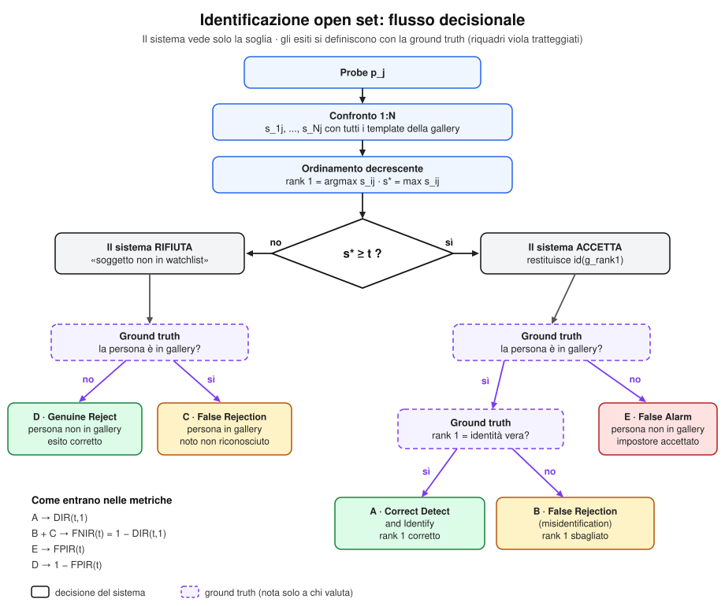

> **Come leggere lo schema.** C'è un solo rombo decisionale (la soglia). Il resto è la ground truth: a sinistra il sistema ha rifiutato, a destra ha accettato. Dentro ogni ramo ci sono gli esiti, che dipendono da due fatti che solo chi valuta conosce: la persona è in gallery? E il rank 1 è la sua identità?

> **Perché l'Identification Open Set è più difficile della Verification?** Nella verifica il sistema deve soddisfare un solo vincolo: confrontare il probe con il template dell'identità dichiarata e verificare che il punteggio superi la soglia (confronto 1:1). Nell'identificazione open set invece bisogna soddisfare **due vincoli contemporaneamente**: (1) effettuare un confronto 1:N con l'intera gallery, ordinare tutti i punteggi e verificare che il migliore superi la soglia di accettazione (per stabilire se il soggetto è noto al sistema); (2) verificare che l'identità associata a quel punteggio massimo sia effettivamente quella corretta. Questo doppio vincolo (soglia + correttezza del match 1:N tra molti candidati) rende l'identificazione open set intrinsecamente più complessa e soggetta a tassi di errore più elevati rispetto alla verifica 1:1.

#### Confronto tra i tre scenari

| | Verifica | Identificazione closed set | Identificazione open set |
|---|---|---|---|
| Domanda | "Sei chi dici di essere?" | "Chi sei, tra gli N noti?" | "Sei uno degli N noti? E se sì, chi?" |
| Confronto | 1:1 | 1:N | 1:N |
| Il probe è sempre in gallery? | Sì (dichiara un'identità) | **Sì** (ipotesi chiusa) | **No** |
| Soglia | Sì | No (si prende il rank 1) | Sì |
| Errori possibili | FAR, FRR | rank 1 sbagliato | falso allarme, falso rifiuto, rank 1 sbagliato |
| Metrica tipica | ROC / DET | CMC (rank-$k$) | DIR e FPIR al variare di $t$ |

### 6.2 Template ordinati, soglia e identità assegnata

Lo schema seguente mostra cosa succede *dentro* il sistema per un singolo probe: i template della gallery vengono ordinati per punteggio, la soglia $t$ divide la lista in due zone, e **solo il template al rank 1** (se sopra soglia) viene restituito come identità.

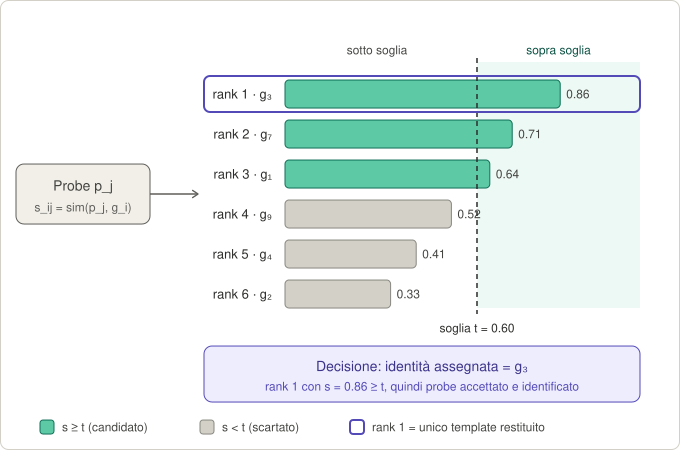

Punti da notare:

- **Il rank non è un'etichetta del sistema.** È la posizione che il template *vero* occupa nella lista. Il sistema conosce solo l'ordinamento, non quale sia quello vero; il rank lo calcola chi valuta.
- **Più template possono stare sopra soglia** (qui $g_3$, $g_7$, $g_1$), ma il sistema ne restituisce uno solo: il rank 1. Gli altri sopra soglia sono candidati scartati.
- **La soglia è un filtro, non un giudice di correttezza.** Superare $t$ significa "abbastanza simile", non "identità giusta". Per questo servono entrambi i vincoli.

### 6.3 Possibili esiti

I cinque casi si distinguono incrociando *dove sta la persona* (in gallery o no) con *cosa fa il sistema*:

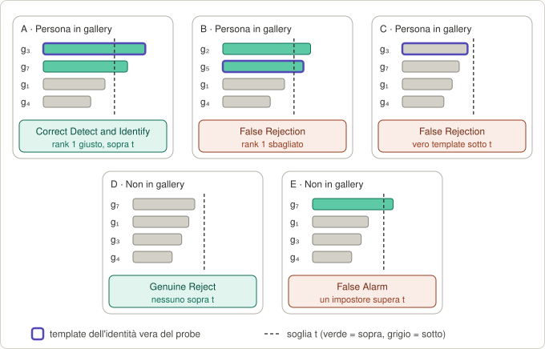

| Caso | Situazione | Esito |
|---|---|---|
| D | Nessun valore sopra soglia, persona non in gallery | Genuine Reject |
| C | Nessun valore sopra soglia, persona in gallery | False Rejection |
| A | Valori sopra soglia, il primo è quello corretto | **Correct Detect and Identify** |
| B | Valori sopra soglia, ma il primo NON è quello corretto | False Rejection (per l'identità corretta) |
| E | Persona non in gallery ma un valore supera la soglia | False Acceptance (**False Alarm**) |

Nel caso B il sistema ha *accettato* qualcuno, ma ha restituito l'identità sbagliata: per la persona vera è comunque un fallimento, quindi conta come falso rifiuto. In altri testi lo trovi anche come *misidentification*.

### 6.4 Rank e Detection and Identification Rate (DIR)

Il **rank** è la posizione nella lista ordinata in cui compare il template dell'identità corretta.

$$
DIR(t,k) = \frac{|\{p_j : rank(p_j) \le k,\ s_{ij} \ge t,\ id(g_i) = id(p_j)\}|}{|P_G|} \quad \forall p_j \in P_G
$$

$$
FRR(t) = 1 - DIR(t,1)
$$

$$
FAR(t) = \frac{|\{p_j : \max_i s_{ij} \ge t\}|}{|P_N|} \quad \forall p_j \in P_N,\ \forall g_i \in G
$$

$$
EER = \{t : FRR(t) = FAR(t)\}
$$

> **Nomenclatura standard ISO nell'open set:** l'equivalente del FRR è la **FNIR (False Negative Identification Rate)** = $1 - DIR(t,1)$; l'equivalente del FAR è la **FPIR (False Positive Identification Rate)**, cioè la probabilità che un impostore ($p_j \in P_N$) venga accettato per errore:
> $$FPIR(t) = \frac{|\{p_j \in P_N : \max_i s_{ij} \ge t\}|}{|P_N|}$$
> Applicazioni tipiche del DIR/open set: videosorveglianza, ricerca persone in grandi database, riconoscimento facciale open-set, applicazioni di *law enforcement*, dove non si sa a priori se il soggetto ripreso sia registrato nel sistema.

### 6.5 Come si derivano le formule

L'idea è una sola: **per ogni tipo di probe si identifica l'evento "errore" o "successo" e se ne calcola la frequenza relativa**. I due tipi di probe ($P_G$ e $P_N$) hanno denominatori diversi perché possono sbagliare in modi diversi.

#### Passo 0: la regola di decisione

Per un probe $p_j$ sia $i^* = \arg\max_i s_{ij}$ e $s^*_j = s_{i^*j} = \max_i s_{ij}$. Il sistema produce

$$
D_t(p_j) = \begin{cases} id(g_{i^*}) & \text{se } s^*_j \ge t \\ \text{rifiuto} & \text{se } s^*_j < t \end{cases}
$$

La soglia $t$ è l'unico parametro. Ogni formula sotto è la frequenza di un evento definito da $D_t$.

#### Passo 1: probe di impostori ($P_N$) → FPIR (il "FAR" dell'open set)

Un impostore non ha un'identità corretta da restituire, quindi qualunque accettazione è un errore. L'evento errore è:

$$
E_N = \{ D_t(p_j) \neq \text{rifiuto} \} = \{ s^*_j \ge t \} = \{\max_i s_{ij} \ge t\}
$$

La frequenza relativa su $P_N$ è la formula FPIR/FAR:

$$
FPIR(t) = \frac{|\{p_j \in P_N : \max_i s_{ij} \ge t\}|}{|P_N|}
$$

Il denominatore è $|P_N|$ perché un falso allarme esiste solo per chi non è in gallery. In termini probabilistici, $FPIR(t) = P(s^* \ge t \mid p \in P_N)$.

**Perché cresce con la dimensione della gallery.** Se per un impostore i punteggi con i singoli template sono indipendenti e ciascuno supera $t$ con probabilità $FAR_{1:1}(t)$ (il FAR della verifica), la probabilità che *almeno uno* dei $N$ lo faccia è

$$
FPIR(t) = 1 - \bigl(1 - FAR_{1:1}(t)\bigr)^N \approx N \cdot FAR_{1:1}(t) \quad (\text{se } N \cdot FAR_{1:1} \ll 1)
$$

Un sistema con $FAR_{1:1} = 0.1\%$ su gallery da $N = 1000$ ha $FPIR \approx 1 - 0.999^{1000} \approx 63\%$. È il motivo quantitativo per cui l'open set è più difficile della verifica e per cui le soglie vanno alzate molto al crescere di $N$. (L'indipendenza è un'assunzione di modello, utile come ordine di grandezza; i punteggi reali sono correlati.)

#### Passo 2: probe di persone note ($P_G$) → DIR

Per un probe noto il successo richiede **tre condizioni insieme**:

1. il template vero compare entro i primi $k$ posti: $rank(p_j) \le k$;
2. quel template ha punteggio sopra soglia: $s_{ij} \ge t$;
3. l'identità coincide: $id(g_i) = id(p_j)$ (è la definizione stessa di "template vero").

L'evento successo è quindi $S_k = \{rank(p_j) \le k \ \wedge\ s_{ij} \ge t \ \wedge\ id(g_i) = id(p_j)\}$ e la sua frequenza relativa su $P_G$ è la formula del DIR:

$$
DIR(t,k) = \frac{|\{p_j : rank(p_j) \le k,\ s_{ij} \ge t,\ id(g_i) = id(p_j)\}|}{|P_G|}
$$

Il denominatore è $|P_G|$: solo chi è in gallery può essere "detected and identified". Per $k = 1$ si chiede che il template vero sia **proprio** quello restituito dal sistema, cioè il caso A. Per $k > 1$ si ammette una shortlist (utile se poi decide un operatore).

**Scomposizione utile.** Per $k=1$, condizionando al fatto che il rank 1 sia corretto:

$$
DIR(t,1) = P(\text{rank 1 corretto} \mid p \in P_G) \cdot P(s^* \ge t \mid \text{rank 1 corretto})
$$

Il primo fattore è il *rank-1 identification rate* del closed set (indipendente da $t$); il secondo è la frazione di genuine con punteggio sopra soglia. Cambiando $t$ si agisce solo sul secondo. Quindi $DIR(t,1)$ **non può superare il rank-1 closed set**, e questo spiega perché la FNIR non va a zero nemmeno con $t$ molto basso.

#### Passo 3: FRR = FNIR

Per un probe noto gli esiti possibili sono mutuamente esclusivi ed esaustivi:

- A: rank 1 giusto e sopra soglia → successo;
- B: rank 1 sbagliato → fallimento;
- C: vero template sotto soglia (e quindi rank 1 sotto soglia o sbagliato) → fallimento.

Quindi la probabilità di fallire è il complemento di quella di riuscire:

$$
FRR(t) = FNIR(t) = 1 - DIR(t,1)
$$

Attenzione: questo complemento vale per $k=1$. Con $k>1$ "non successo entro rank $k$" non coincide con l'errore del sistema, perché il sistema restituisce comunque solo il rank 1.

#### Passo 4: andamento con $t$ ed EER

- Alzando $t$, meno impostori superano la soglia → **FPIR scende** (monotona non crescente).
- Alzando $t$, meno noti superano la soglia → $DIR(t,1)$ scende → **FNIR sale** (monotona non decrescente).

Una funzione che scende e una che sale si incrociano: l'**EER** è il valore di $t$ (e del tasso) in cui

$$
FNIR(t^*) = FPIR(t^*)
$$

Nei dati reali, con insiemi finiti, le curve sono a gradini e l'uguaglianza esatta può non esistere: si prende il $t$ che minimizza $|FNIR(t) - FPIR(t)|$. La curva $\bigl(FPIR(t),\, DIR(t,1)\bigr)$ al variare di $t$ è la **ROC dell'open set**; con $DIR(0,k)$ al variare di $k$ si ottiene invece la **CMC**, che è il caso closed set.

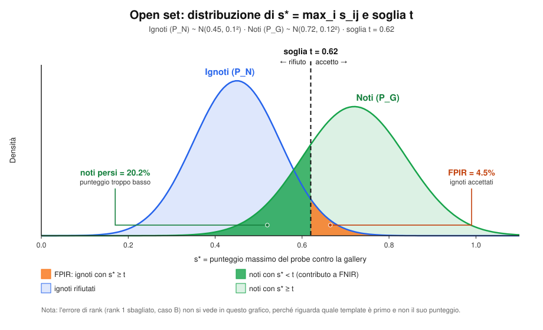

> Nel grafico l'area arancione a destra di $t$ è la FPIR (impostori accettati); l'area verde a sinistra di $t$ è la quota di noti persi per punteggio troppo basso. A questa si somma l'errore di rank, che nel grafico non si vede perché riguarda *quale* template è al primo posto, non il suo punteggio.

#### Esempio numerico

Si valuta un sistema con $|P_G| = 200$ probe noti e $|P_N| = 300$ probe di impostori, con una certa soglia $t$.

- Tra i 200 noti: 150 hanno il rank 1 corretto e sopra soglia (caso A); 30 hanno il template vero sotto soglia (caso C); 20 hanno un rank 1 sbagliato (caso B).
- Tra i 300 impostori: 24 hanno $\max_i s_{ij} \ge t$ (caso E).

Allora

$$
DIR(t,1) = \frac{150}{200} = 0.75, \qquad FNIR(t) = 1 - 0.75 = 0.25 = \frac{30 + 20}{200}, \qquad FPIR(t) = \frac{24}{300} = 0.08
$$

Con una soglia più alta, per esempio, la FPIR potrebbe scendere verso 0.02 ma la FNIR salirebbe oltre 0.25: questo è il compromesso che si legge sulla curva ROC.

### 6.6 Cinque aree operative (scelta soglia watchlist)

La soglia non è un valore "giusto" in assoluto: dipende dal costo relativo dei due errori nell'applicazione. Le cinque aree corrispondono a cinque posizioni sulla curva ROC dell'open set:

| # | Area operativa | Soglia | Quando ha senso |
|---|---|---|---|
| 1 | Falso allarme estremamente basso (es. sorveglianza pubblica) | $t$ molto alta | Ogni falso allarme ferma o disturba una persona innocente: meglio perdere qualche sospetto |
| 2 | Probabilità di detect/identify estremamente alta (falsi allarmi secondari) | $t$ molto bassa | Non si vuole perdere nessun sospetto; i match vengono poi verificati da un operatore |
| 3 | Basso falso allarme e basso detect/identify | $t$ alta | Sistema prudente: pochi allarmi, ma ne riconosce pochi |
| 4 | Alto falso allarme e alto detect/identify | $t$ bassa | Sistema permissivo: riconosce molto, ma genera molti allarmi |
| 5 | Nessuna soglia: si vogliono tutti i risultati con relativa confidenza | assente | Decide l'utente guardando la lista ordinata (ricerca investigativa) |

### 6.7 Riepilogo rapido

- **Verifica**: 1:1, un solo vincolo (soglia).
- **Open set**: 1:N, due vincoli (soglia **e** rank 1 corretto).
- **FPIR** si misura sugli impostori ($P_N$): conta chi supera la soglia con *qualunque* template. Cresce circa come $N \cdot FAR_{1:1}$.
- **DIR(t,1)** si misura sui noti ($P_G$): conta chi ha il rank 1 corretto **e** sopra soglia.
- **FNIR = 1 - DIR(t,1)**.
- Alzare $t$ → meno falsi allarmi, più falsi rifiuti. L'**EER** è il punto in cui si equivalgono.

---

## 7. Identificazione Closed Set

Caso speciale: si assume che **ogni probe appartenga a un soggetto enrollato** (non realistico, ma utile per valutare le prestazioni perché più semplice da calcolare).

- **Non c'è soglia.**
- L'unica domanda è: *chi è questa persona?*
- L'unico errore possibile è la **False Rejection** (identità corretta non al primo posto); **non esiste False Acceptance**.
- Il FRR del closed set si calcola come complemento del **Recognition Rate** (= CMS al rango 1):

$$
FRR_{closed} = 1 - CMS(1) = 1 - RR
$$

### 7.0 Notazione e procedura

| Simbolo | Significato |
|---|---|
| $G = \{g_1, \dots, g_N\}$ | Gallery con $N$ identità enrollate |
| $P$ | Insieme dei probe; nel closed set **tutti** hanno l'identità in $G$ (quindi $P = P_G$ e $P_N = \emptyset$) |
| $s_{ij} = sim(p_j, g_i)$ | Punteggio di similarità tra probe $j$ e template $i$ |
| $rango(p_j)$ | Posizione del template della vera identità di $p_j$ nella lista ordinata per punteggio decrescente ($1 \le rango \le N$) |

Procedura per un probe $p_j$:

1. si calcolano i punteggi con **tutti** i template della gallery (confronto 1:N);
2. si ordinano i template per punteggio decrescente;
3. si restituisce l'identità del template al **rank 1**, **senza alcun test di soglia**.

Il sistema risponde quindi sempre con un'identità. Chi valuta, conoscendo la ground truth, guarda a che rank compare il template vero.

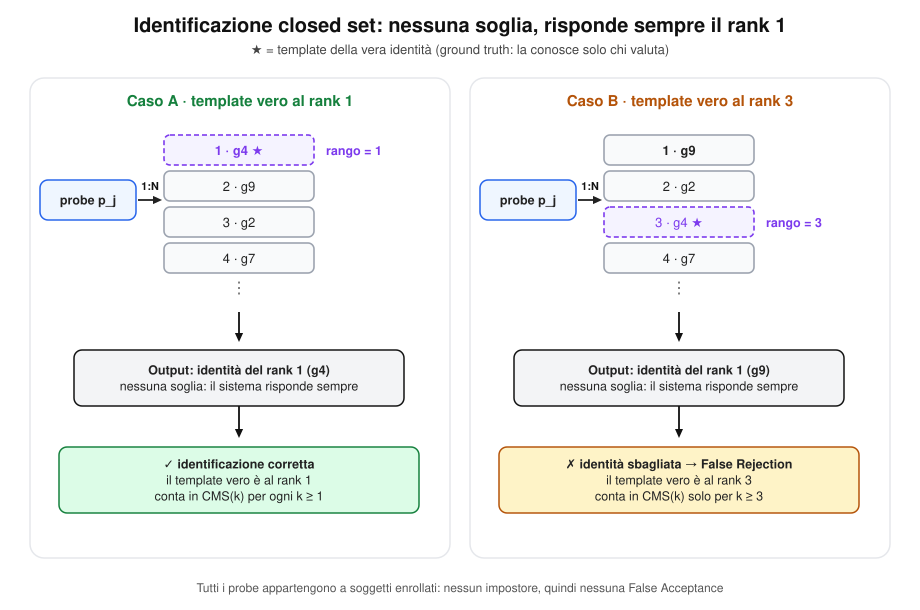

Lo schema mostra due probe:

- **Caso A**: il template vero è al rank 1 → identificazione corretta.
- **Caso B**: il template vero è al rank 3 → il sistema restituisce l'identità sbagliata, quindi per la persona vera è un falso rifiuto. Il probe comunque "conta" nel CMS per ogni $k \ge 3$ (vedi 7.1).

#### Come si derivano RR e FRR

Per un probe sono possibili solo due eventi, mutuamente esclusivi ed esaustivi:

- successo: $rango(p_j) = 1$;
- errore: $rango(p_j) \ge 2$.

La frequenza relativa del successo su $P$ è il Recognition Rate:

$$
RR = \frac{|\{p_j : rango(p_j) = 1\}|}{|P|}
$$

Poiché l'errore è il complemento del successo:

$$
FRR_{closed} = \frac{|\{p_j : rango(p_j) \ge 2\}|}{|P|} = 1 - RR
$$

Non esiste una FAR perché non esistono impostori: non c'è nessuno da "accettare per errore". Nota sulla terminologia: in senso stretto l'errore del closed set è una *misidentification* (il sistema restituisce un'identità, ma sbagliata); lo si chiama False Rejection per coerenza con l'open set, dove lo stesso evento ha lo stesso nome.

#### Relazione con l'open set

Il closed set è l'open set **senza soglia** e senza impostori:

$$
CMS(k) = DIR(t_{min},\,k) \qquad \text{e quindi} \qquad RR = DIR(t_{min},\,1)
$$

dove $t_{min}$ è una soglia così bassa da accettare sempre il rank 1. Poiché alzare $t$ può solo ridurre il DIR, vale

$$
DIR(t,1) \le RR \quad \forall t
$$

cioè il Recognition Rate del closed set è un **limite superiore** per il DIR dell'open set. Per questo il closed set è utile come stima ottimistica (e facile da calcolare) delle prestazioni, ma non basta per valutare un sistema di watchlist.

| | Closed set | Open set |
|---|---|---|
| Il probe è sempre in gallery? | Sì | No |
| Soglia | No | Sì |
| Errori | solo rank 1 sbagliato | falso allarme, falso rifiuto, rank 1 sbagliato |
| Metrica | CMC, RR | DIR e FPIR al variare di $t$ |

### 7.1 Cumulative Match Characteristic (CMC) curve

**CMS (Cumulative Match Score) a rango k** = probabilità che l'identità corretta sia tra le prime k posizioni della lista ordinata.

- CMS a rango 1 = **Recognition Rate** (probabilità che sia esattamente al primo posto).
- La curva CMC raggiunge sempre probabilità 1 (perché tutti sono in gallery, quindi prima o poi compare).
- Area sotto la curva massima = dimensione della gallery; si può normalizzare dividendo per il massimo.
- Si usano spesso CMS a rango 1, 5, 10 come indicatori sintetici.

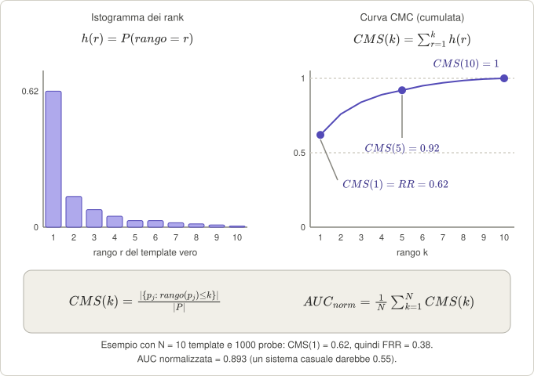

#### Come si deriva la CMC

**1. Istogramma dei rank.** Per ogni probe si registra il rank del template vero. La frazione di probe con rango esattamente $r$ è

$$
h(r) = P(rango = r) = \frac{|\{p_j : rango(p_j) = r\}|}{|P|}, \qquad \sum_{r=1}^{N} h(r) = 1
$$

La somma vale 1 perché ogni probe ha un rango in $\{1, \dots, N\}$.

**2. Cumulata.** Il CMS a rango $k$ è la frazione di probe con rango **al più** $k$:

$$
CMS(k) = \frac{|\{p_j : rango(p_j) \le k\}|}{|P|} = \sum_{r=1}^{k} h(r)
$$

La CMC è quindi la **funzione di distribuzione cumulata** del rango del template vero.

**3. Proprietà (seguono dalla definizione).**

- $CMS(1) = h(1) = RR$: la curva parte dal Recognition Rate, non da zero.
- **Non decrescente**: l'insieme $\{rango \le k\}$ può solo crescere con $k$, quindi $CMS(k+1) \ge CMS(k)$.
- $CMS(N) = 1$: nel closed set il template vero è sempre in gallery, quindi ha rango $\le N$. Nell'open set questo non vale, perché gli impostori non hanno un template vero.
- Un sistema che ordina a caso ha $CMS(k) = k/N$ (retta), che serve da riferimento minimo.

**4. Area sotto la curva.** Sommando su tutti i rank il massimo possibile si ottiene $CMS(k) = 1$ per ogni $k$, cioè un'area pari a $N$. Dividendo per $N$ si ha l'area normalizzata, compresa tra circa $0.5$ (sistema casuale) e $1$ (sistema perfetto):

$$
AUC_{norm} = \frac{1}{N} \sum_{k=1}^{N} CMS(k)
$$

Per un sistema casuale $AUC_{norm} = \frac{1}{N}\sum_{k=1}^{N}\frac{k}{N} = \frac{N+1}{2N}$, che per $N=10$ vale $0.55$.

#### Esempio numerico (quello della figura)

Gallery con $N = 10$ template e $|P| = 1000$ probe. I rank osservati sono:

| rango $r$ | 1 | 2 | 3 | 4 | 5 | 6 | 7 | 8 | 9 | 10 |
|---|---|---|---|---|---|---|---|---|---|---|
| n. probe | 620 | 140 | 80 | 50 | 30 | 30 | 20 | 15 | 10 | 5 |
| $h(r)$ | 0.62 | 0.14 | 0.08 | 0.05 | 0.03 | 0.03 | 0.02 | 0.015 | 0.01 | 0.005 |
| $CMS(r)$ | 0.62 | 0.76 | 0.84 | 0.89 | 0.92 | 0.95 | 0.97 | 0.985 | 0.995 | 1 |

Quindi $RR = CMS(1) = 0.62$, $FRR_{closed} = 0.38$, $CMS(5) = 0.92$ e $AUC_{norm} = 8.93 / 10 = 0.893$.

**Come si leggono gli indicatori sintetici.** $CMS(1)$ dice quanto spesso il sistema "ci azzecca" da solo. $CMS(5)$ e $CMS(10)$ sono interessanti quando l'output è una **shortlist** rivista da un operatore: con $CMS(5) = 0.92$ il template giusto è tra i primi cinque candidati nel 92% dei casi, anche se solo nel 62% è il primo.

### 7.2 Identificazione vs Re-Identificazione

- **Identificazione**: il sistema riceve una probe e deve stabilire **chi è**, confrontandola con l'intera gallery. Orizzonte temporale medio/lungo; può essere open o closed set; l'output è un'**identità precisa** (un nome/ID).
- **Re-Identificazione (Re-ID)**: il sistema deve ritrovare **la stessa persona** in immagini/frame diversi (tipicamente provenienti da telecamere diverse), su un orizzonte temporale breve, **senza necessariamente conoscerne l'identità reale**. Non cerca un nome, ma una corrispondenza tra apparizioni della stessa persona — tipica della videosorveglianza e del tracking multi-camera; è tipicamente closed set, e l'output è "stessa persona / persona diversa" anziché un'identità.
- La Re-ID si valuta con la **CMC** (quando c'è una sola immagine di gallery per query) o con la **mAP (mean Average Precision)**, quando più immagini di gallery corrispondono alla stessa query.

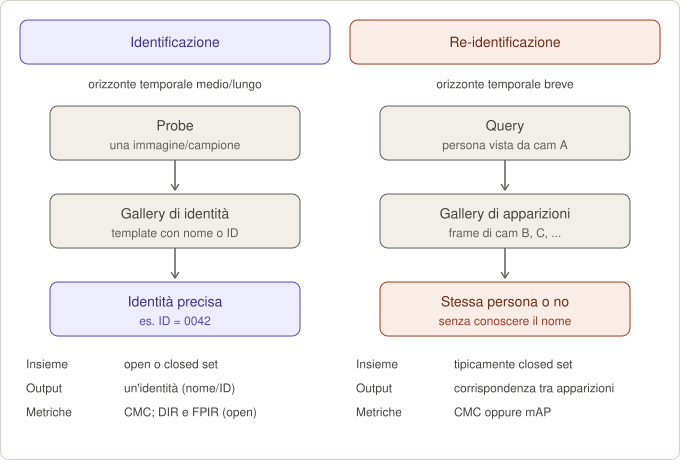

#### Perché la mAP e non solo la CMC

Nella CMC conta **solo la posizione del primo match corretto**: se per una query il primo è al rank 1, il resto della lista è irrilevante. Questo va bene quando c'è una sola immagine corretta in gallery. In Re-ID, invece, la stessa persona compare di solito in **più** frame di gallery, e un buon sistema deve metterli tutti in alto: la CMC non lo misura, la mAP sì.

#### Come si deriva la mAP

**1. Precisione al rango $k$** (per una query $q$): frazione di immagini corrette tra le prime $k$.

$$
P(k) = \frac{\text{n. di immagini corrette nei primi } k}{k}
$$

**2. Average Precision.** Si media $P(k)$ **solo nei rank dove compare un'immagine corretta**, usando $rel(k) = 1$ se l'immagine al rank $k$ è la stessa persona e $0$ altrimenti:

$$
AP(q) = \frac{1}{|R_q|} \sum_{k=1}^{n} P(k)\, rel(k)
$$

dove $R_q$ è l'insieme delle immagini corrette per $q$ e $n$ la lunghezza della lista. Il fattore $\frac{1}{|R_q|}$ normalizza: $AP = 1$ solo se **tutte** le immagini corrette sono ai primi posti, e ogni corretta messa in basso abbassa il valore.

**3. Media sulle query.**

$$
mAP = \frac{1}{|Q|} \sum_{q \in Q} AP(q)
$$

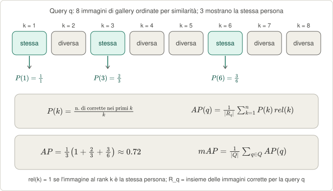

**Esempio (quello della figura).** Le immagini corrette sono ai rank 1, 3 e 6, quindi $|R_q| = 3$ e

$$
AP = \frac{1}{3}\left(\frac{1}{1} + \frac{2}{3} + \frac{3}{6}\right) \approx 0.72
$$

Se le tre corrette fossero ai rank 1, 2, 3 si avrebbe $AP = \frac{1}{3}(1 + 1 + 1) = 1$; se fossero ai rank 6, 7, 8, $AP = \frac{1}{3}(\frac{1}{6} + \frac{2}{7} + \frac{3}{8}) \approx 0.28$.

**CMC e mAP a confronto.**

| | CMC / CMS($k$) | mAP |
|---|---|---|
| Cosa guarda | posizione del **primo** match corretto | posizione di **tutti** i match corretti |
| Quando usarla | una sola immagine corretta in gallery per query | più immagini corrette per query |
| Risposta | "il match giusto è nei primi $k$?" | "quanto in alto stanno tutti i match giusti?" |

### 7.3 Riepilogo rapido

- **Closed set**: nessuna soglia, nessun impostore; l'unico errore è il rank 1 sbagliato.
- $RR = CMS(1)$ e $FRR_{closed} = 1 - RR$.
- $CMS(k) = \sum_{r=1}^{k} h(r)$: la CMC è la cumulata dell'istogramma dei rank; parte da $RR$, non decresce e arriva a 1.
- $DIR(t,1) \le RR$: il closed set è un limite superiore per l'open set.
- **Re-ID** = ritrovare la stessa persona su più telecamere, senza nome; si valuta con CMC (un solo match) o mAP (più match).

---

## 8. Progettazione sperimentale (Offline Evaluation)

La valutazione statistica avviene **offline**, su dataset con **ground truth** noto (`id(template)` restituisce l'identità vera). In produzione questo non è disponibile (es. attacco "zero effort").

### 8.1 Tre scelte di partizionamento del dataset

1. **Training vs Testing (TR/TS)**
   - Necessario per approcci machine learning.
   - **Nessuna sovrapposizione** tra campioni di training e testing.
   - Il training deve includere campioni di qualità/condizioni varie per garantire **generalizzabilità**.
   - Partizionamento per **soggetti** (subject mai visti = never seen subjects) o per **campioni** (stesso soggetto in TR e TS ma campioni diversi).

2. **Probe vs Gallery (P/G)**
   - Scelta 1: campioni migliori in gallery, condizioni variabili nel probe.
   - Scelta 2: condizioni variabili anche in gallery (per riconoscere meglio in diverse condizioni).
   - Sempre nessuna sovrapposizione tra probe e gallery.

3. **Open set vs Closed set**
   - Closed set: tutte le probe appartengono a soggetti in gallery.
   - Open set: probe = PG ∪ PN (soggetti in gallery + soggetti fuori gallery).
   - Non influisce sulla verifica (dipende solo dal claim), ma è cruciale nell'identificazione open set.

### 8.2 K-Fold Cross Validation

Il dataset è diviso in k sottoinsiemi; si ripete k volte l'addestramento usando k−1 sottoinsiemi come training e 1 come test, ruotando. L'errore finale è la **media** sui k trial. Tipicamente **k = 5 o 10**.

---

## 9. Strategia All-Against-All

Invece di simulare **una sola rivendicazione d'identità per ogni probe** (es. "sono Mario"), si valutano **tutte le coppie possibili**: ogni probe $i$ viene confrontato con ogni campione $j$ della galleria, come se potesse dichiarare *qualsiasi* identità.

Grazie al **ground truth** (si conosce $\mathrm{label}(\cdot)$ di ogni campione) non serve ripetere gli esperimenti: si calcola **una sola volta** la matrice $M$ delle distanze (o similarità) e poi ogni cella viene classificata come *genuina* o *impostore*. Ogni riga della matrice rappresenta quindi **più esperimenti**.

### 9.1 Matrice delle distanze

$$
M \in \mathbb{R}^{|P|\times|G|}, \qquad M[i,j] = d\big(\text{probe}_i,\ \text{gallery}_j\big)
$$

$$
\text{la cella } (i,j) \text{ è }
\begin{cases}
\textbf{genuina} & \mathrm{label}(i)=\mathrm{label}(j)\\
\textbf{impostore} & \mathrm{label}(i)\neq\mathrm{label}(j)
\end{cases}
$$

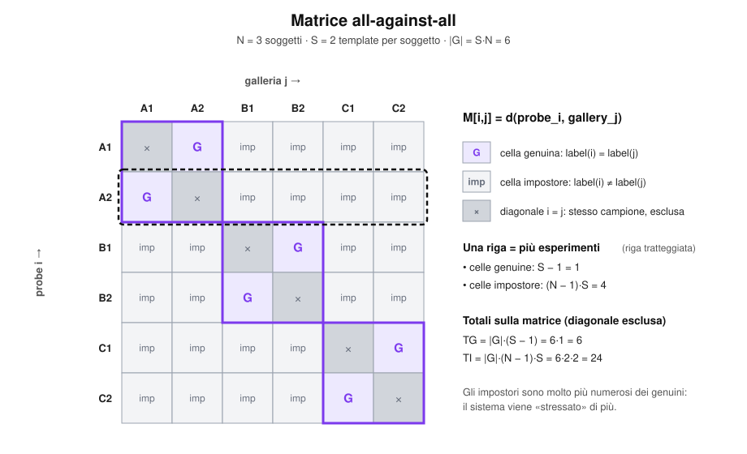

**Vantaggi**

- Facile da programmare; calcola una "media" su tutte le possibili distribuzioni genuino/impostore.
- Gli impostori sono molto più numerosi dei genuini (rapporto $\frac{(N-1)S}{S-1}$ per riga) → si può **stressare molto** il sistema.

**Svantaggi**

- Tempo computazionale elevato: $O(|G|^2)$ confronti.
- Non permette di analizzare distribuzioni genuino/impostore *specifiche* (es. solo certi soggetti).
- Non adatto se il dataset ha **sessioni** temporalmente separate: campioni della stessa sessione sono più simili tra loro, quindi i genuini risultano troppo vicini e le prestazioni **ottimisticamente falsate**. In tal caso si usa la variante **All-Against-All Probe vs Gallery** (§10): una sessione = galleria, un'altra = probe.

### 9.2 Notazione

| Simbolo | Significato |
|---|---|
| $N$ | numero di soggetti |
| $S$ | numero di template per soggetto |
| $\lvert G\rvert = S\cdot N$ | cardinalità della galleria (campioni totali) |
| $i$ | indice di riga (probe) |
| $j$ | indice di colonna (galleria) |
| $\mathrm{label}(i),\ \mathrm{label}(j)$ | identità associate |
| $t$ | soglia di decisione: si **accetta** se $M[i,j]\le t$ |
| $TG,\ TI$ | numero totale di tentativi genuini / impostori |
| $GA,\ FR,\ FA,\ GR$ | genuine accept / false reject / false accept / genuine reject |

### 9.3 Come la soglia classifica le celle

Fissata $t$, ogni esperimento ha uno di quattro esiti:

$$
\begin{array}{c|cc}
 & M[i,j]\le t \ (\text{accettato}) & M[i,j]> t \ (\text{rifiutato})\\ \hline
\text{genuino} & GA & FR\\
\text{impostore} & FA & GR
\end{array}
$$

con le relazioni

$$
GA+FR = TG, \qquad FA+GR = TI
$$

$$
GAR(t)=\frac{GA}{TG},\quad FRR(t)=\frac{FR}{TG}=1-GAR(t),\quad
FAR(t)=\frac{FA}{TI},\quad GRR(t)=\frac{GR}{TI}=1-FAR(t)
$$

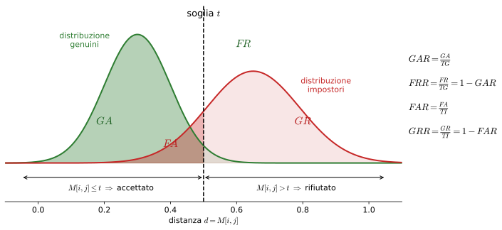

> Spostare $t$ a destra **aumenta** $GAR$ ma anche $FAR$; spostarla a sinistra fa il contrario. Variando $t$ si ottengono le curve ROC / DET.

---

### 9.4 Verifica — Single Template

Ogni campione della galleria è confrontato **singolarmente**. Per ogni riga $i$ (escludendo la diagonale $i=j$):

- celle genuine: gli altri $S-1$ campioni della stessa identità;
- celle impostore: gli $(N-1)\cdot S$ campioni delle altre identità.

$$
\boxed{TG = |G|\cdot(S-1)} \qquad \boxed{TI = |G|\cdot(N-1)\cdot S}
$$

```
for each threshold t
    for each cell M[i,j] con i ≠ j
        if M[i,j] ≤ t then
            if label(i) = label(j) then GA++
            else FA++
        else
            if label(i) = label(j) then FR++
            else GR++
    GAR(t) = GA/TG ;  FAR(t) = FA/TI
    FRR(t) = FR/TG ;  GRR(t) = GR/TI
```

**Esempio numerico** ($N=3,\ S=2,\ |G|=6$, $t=0.40$): $TG=6\cdot1=6$, $TI=6\cdot2\cdot2=24$. Le celle con contorno verde sono quelle accettate ($M[i,j]\le t$).

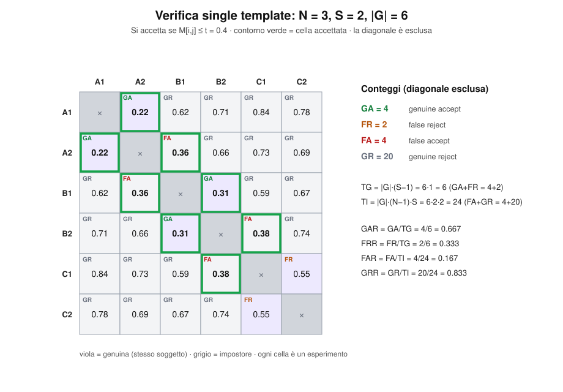

Si verifica che $GA+FR=4+2=6=TG$ e $FA+GR=4+20=24=TI$.

---

### 9.5 Verifica — Multiple Template

Quando la galleria ha $S$ template per soggetto, la decisione è **per identità**, non per campione: per ogni riga $i$ le colonne si raggruppano per label,

$$
\mathcal{M}_X = \{\, M[i,j] \;:\; \mathrm{label}(j)=X,\ j\neq i \,\}
$$

e di ogni gruppo si tiene il **miglior match** (distanza minima):

$$
d_X = \min \mathcal{M}_X
$$

Poiché ogni riga produce **un esperimento per identità** ($N$ in tutto, di cui 1 genuino e $N-1$ impostori):

$$
\boxed{TG = |G|} \qquad \boxed{TI = |G|\cdot(N-1)}
$$

```
for each threshold t
    for each row i
        for each gruppo M_label di celle M[i,j] con stessa label(j), escludendo M[i,i]
            diff = min(M_label)
            if diff ≤ t then
                if label(i) = label(M_label) then GA++
                else FA++
            else
                if label(i) = label(M_label) then FR++
                else GR++
    GAR(t) = GA/TG ; FAR(t) = FA/TI ; FRR(t) = FR/TG ; GRR(t) = GR/TI
```

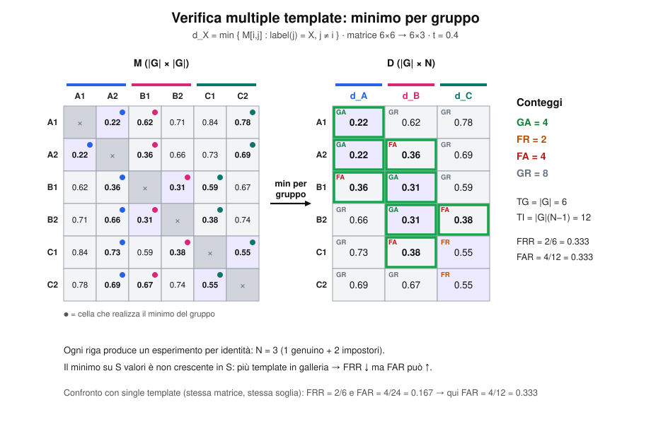

Nell'esempio la matrice $6\times6$ si riduce a una matrice $6\times3$ ($|G|\times N$); con $t=0.40$ si ottiene $GA=4,\ FR=2$ (somma $=TG=6$) e $FA=4,\ GR=8$ (somma $=TI=12$).

> **Effetto di $S$ sul compromesso errori.**
> Più campioni in galleria per soggetto → **diminuisce $FRR$** (più occasioni di trovare un match corretto, perché il minimo di più valori è più piccolo) ma **può aumentare $FAR$** (più occasioni per un impostore di assomigliare a un template).
> In formula: $\min$ su $S$ valori è non crescente in $S$, quindi sia i genuini sia gli impostori si spostano verso distanze minori.

---

## 10. All-Against-All — Probe vs Gallery (sessioni separate)

Probe e galleria provengono da **sessioni diverse** e **non condividono campioni**: non esiste diagonale da escludere. Si ha $|P|=|G|=S\cdot N$ e tutte le $|P|\cdot|G|$ celle sono utilizzabili.

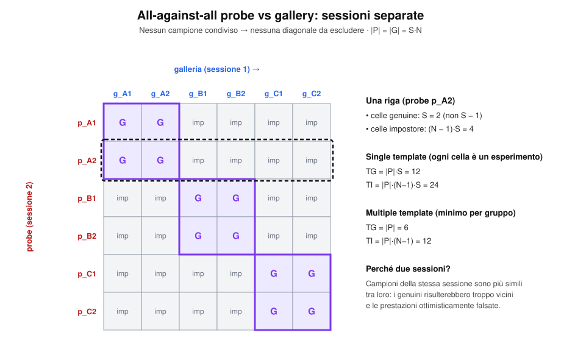

### 10.1 Verifica

**Single template** (ogni cella è un esperimento):

$$
TG = |P|\cdot S \qquad TI = |P|\cdot(N-1)\cdot S
$$

**Multiple template** (min per gruppo, un esperimento per identità):

$$
TG = |P| \qquad TI = |P|\cdot(N-1)
$$

Confronto con il caso §9 (con diagonale): al posto di $S-1$ genuini per riga se ne hanno $S$, perché il campione di probe non è presente in galleria.

### 10.2 Identificazione Open Set (multiple template)

Qui **non c'è un claim**: il sistema deve decidere *chi* è il probe, oppure rispondere "sconosciuto". Per questo ogni riga rappresenta **2 esperimenti**, uno per ciascuno scenario:

| Scenario | Situazione | Esito |
|---|---|---|
| **Genuino** | l'identità del probe **è** in galleria | valutiamo se viene riconosciuta al rango $k$ |
| **Impostore** | l'identità del probe **non è** in galleria (si rimuove) | valutiamo se viene erroneamente accettata |

$$
\boxed{TG = |G|} \qquad \boxed{TI = |G|}
$$

Per ogni riga $i$ si costruisce la lista $L[i]$ delle distanze (una per identità, minimo per gruppo) **ordinata in modo crescente**, e $L[i,k]$ è il $k$-esimo elemento.

$$
L[i,1]\le L[i,2]\le\dots
$$

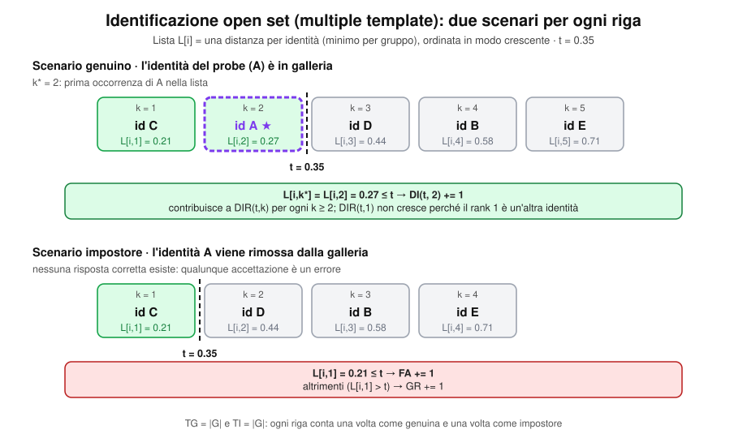

**Scenario genuino.** Sia $k^\*$ il rango della prima occorrenza con $\mathrm{label}=\mathrm{label}(i)$. Si ha un'identificazione corretta al rango $k^\*$ se

$$
L[i,k^\*]\le t \quad\Longrightarrow\quad DI(t,k^\*)\mathrel{+}=1
$$

**Scenario impostore.** Rimossa l'identità del probe, qualunque elemento $L[i,1]\le t$ è un'accettazione errata:

$$
L[i,1]\le t \Longrightarrow FA\mathrel{+}=1, \qquad \text{altrimenti } GR\mathrel{+}=1
$$

**Metriche.**

$$
DIR(t,1)=\frac{DI(t,1)}{TG}, \qquad FRR(t)=1-DIR(t,1)
$$

$$
DIR(t,k)=\frac{DI(t,k)}{TG}+DIR(t,k-1) \quad (k\ge2)
$$

$$
FAR(t)=\frac{FA}{TI}, \qquad GRR(t)=\frac{GR}{TI}
$$

$DIR(t,k)$ è il **Detection & Identification Rate** al rango $k$: frazione di probe genuini correttamente riconosciuti *entro* i primi $k$ candidati e con distanza $\le t$.

Pseudocodice concettuale:

```
for each threshold t
    for each row i
        L[i] = lista ordinata crescente delle distanze M[i,j] (esclusa diagonale)
        if L[i,1] ≤ t then                          # potenziale accettazione
            if label(i) = label(L[i,1]) then DI(t,1)++     # caso genuino
            cerca il primo L[i,k] con label diversa e ≤ t → se esiste: FA++   # caso impostore
            altrimenti cerca il primo L[i,k] con stessa label e ≤ t
                → se esiste: DI(t,k)++ ; FA++
        else GR++
    DIR(t,1) = DI(t,1)/TG ;  FRR(t) = 1 - DIR(t,1)
    FAR(t) = FA/TI ;  GRR(t) = GR/TI
    # per ranghi superiori:
    DIR(t,k) = DI(t,k)/TG + DIR(t,k-1)
```

### 10.3 Identificazione Closed Set

Si assume che il probe **sia sempre in galleria**: non esistono impostori e **non serve soglia**. Si misura solo *a che rango* compare l'identità corretta.

$$
TA = |P|
$$

Per ogni riga si ordina $L[i]$ e si cerca il primo $k$ tale che $\mathrm{label}(i)=\mathrm{label}(L[i,k])$; si incrementa $CMS(k)$ (Cumulative Match Score). Poi:

$$
CMS(1)=\frac{n_1}{TA}=RR, \qquad
CMS(k)=\frac{n_k}{TA}+CMS(k-1)\quad (k=2,\dots,K)
$$

dove $n_k$ è il numero di probe la cui identità corretta compare **per la prima volta** al rango $k$, e $K=|G|-1$ (caso con diagonale) oppure $K=|G|$ (probe vs gallery).

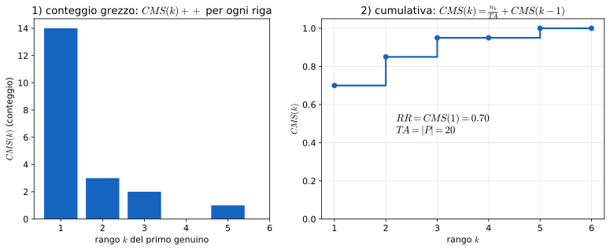

Proprietà utili:

- $CMS(k)$ è **non decrescente** e $CMS(K)=1$ (la risposta giusta è sempre da qualche parte).
- $RR = CMS(1)$ è il **Recognition Rate** (rango-1).

```
for each row i
    L[i] = lista ordinata crescente delle distanze M[i,j]
    trova il primo L[i,k] tale che label(i) = label(L[i,k])
    CMS(k)++
CMS(1) = CMS(1)/TA ;  RR = CMS(1)
for k = 2 to |G|-1
    CMS(k) = CMS(k)/TA + CMS(k-1)
```

---

## 11. Doddington Zoo (e Biometric Menagerie)

### 11.0 Idea di fondo

Un sistema biometrico non è "ugualmente bravo" con tutti gli utenti: tipicamente gli errori sono **concentrati su pochi individui**. Doddington (riconoscimento vocale) ha classificato gli utenti in base al comportamento medio dei loro score, collegando ogni tipologia di utente a 4 animali; Yager e Dunstone hanno poi esteso la classificazione con quattro nuovi animali, basati sul piano (media genuini, media impostori).

> **Convenzione.** Gli score $s$ sono **similarità**: più alto = più simile, si accetta se $s>t$. Con le distanze (come in §9–10) tutte le disuguaglianze si invertono.

### 11.1 Definizioni formali

Sia $s(j,k)$ lo score del probe $j$ confrontato con il template $k$ (matrice della §9). Per ogni utente $k$:

$$
G_k=\{\,s(k,k)\,\} \qquad
I_k^{\mathrm{vit}}=\{\,s(j,k)\,\}_{j\neq k} \qquad
I_k^{\mathrm{att}}=\{\,s(k,j)\,\}_{j\neq k}
$$

$$
I_k = I_k^{\mathrm{vit}}\cup I_k^{\mathrm{att}}
$$

- $G_k$ = score **genuini** di $k$ (diagonale);
- $I_k^{\mathrm{vit}}$ = score ottenuti dagli altri quando **attaccano $k$** (colonna: $k$ è la *vittima*);
- $I_k^{\mathrm{att}}$ = score ottenuti da $k$ quando **attacca gli altri** (riga: $k$ è l'*attaccante*).

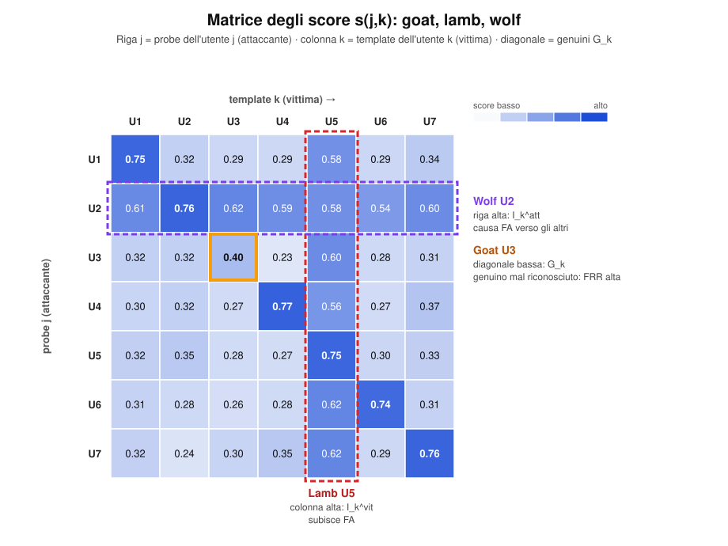

Per ogni utente si calcolano medie e deviazioni standard, e si confrontano con quelle della popolazione ($\mu_G,\sigma_G,\mu_I,\sigma_I$):

$$
\mu_G(k)=\mathbb{E}[G_k],\quad \mu_I(k)=\mathbb{E}[I_k],\quad
z_G(k)=\frac{\mu_G(k)-\mu_G}{\sigma_G},\quad
z_I(k)=\frac{\mu_I(k)-\mu_I}{\sigma_I}
$$

Un utente è "anomalo" quando $|z|$ supera una soglia $\tau$ (tipicamente un percentile, es. 5–10% estremo).

### 11.2 Il piano $(\mu_G,\ \mu_I)$ — Yager e Dunstone

Ogni utente è un punto $(\mu_G(k),\mu_I(k))$ nel piano; le medie di popolazione dividono il piano in quattro quadranti.

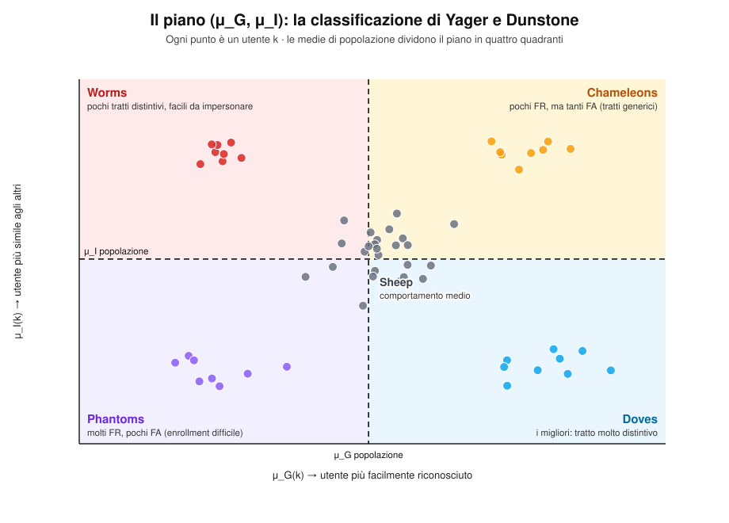

| Categoria | $\mu_G(k)$ | $\mu_I(k)$ | Condizione | Effetto |
|---|---|---|---|---|
| **Doves** (colombe) | alto | basso | $z_G>\tau,\ z_I<-\tau$ | I migliori: tratto molto distintivo, raramente causano errori |
| **Chameleons** | alto | alto | $z_G>\tau,\ z_I>\tau$ | Raramente causano FR, ma facilmente causano FA (tratti generici) |
| **Phantoms** | basso | basso | $z_G<-\tau,\ z_I<-\tau$ | Causano FR, raramente FA (difficoltà di enrollment/estrazione feature) |
| **Worms** (vermi) | basso | alto | $z_G<-\tau,\ z_I>\tau$ | I peggiori: pochi tratti distintivi, facili da impersonare |
| **Sheep** (pecore) | ≈ media | ≈ media | $\lvert z\rvert\le\tau$ | Comportamento normale/buono: la maggioranza della popolazione |

### 11.3 Gli animali di Doddington basati sull'asimmetria

Questi tre animali non guardano solo $\mu_I$ complessivo, ma **quale parte** di $I_k$ è anomala:

| Categoria | Parte anomala | Condizione | Effetto |
|---|---|---|---|
| **Goats** (capre) | $G_k$ (diagonale) | $z_G(k)<-\tau$ | $FRR$ più alta della media: sono mal riconosciuti |
| **Lambs** (agnelli) | $I_k^{\mathrm{vit}}$ (colonna) | $\mu(I_k^{\mathrm{vit}})$ alto | Facilmente impersonabili → più $FA$ **contro di loro** |
| **Wolves** (lupi) | $I_k^{\mathrm{att}}$ (riga) | $\mu(I_k^{\mathrm{att}})$ alto | Bravi a impersonare → causano $FA$ **verso gli altri** |

Perché la distinzione è importante: un agnello è una **vittima** (la colonna $k$ della matrice è chiara), un lupo è un **attaccante** (la riga $k$ è chiara). Lo stesso utente può essere entrambe le cose, o nessuna delle due.

### 11.4 Impatto sulle prestazioni

Per una soglia $t$, gli errori *per utente* sono (accettazione se $s>t$):

$$
FRR_k(t)=P\big(s\le t \mid s\in G_k\big)\qquad
FAR_k(t)=P\big(s> t \mid s\in I_k\big)
$$

Sotto un'approssimazione gaussiana $G_k\sim\mathcal N(\mu_G(k),\sigma^2)$, $I_k\sim\mathcal N(\mu_I(k),\sigma^2)$:

$$
FRR_k(t)=\Phi\!\left(\frac{t-\mu_G(k)}{\sigma}\right) \qquad
FAR_k(t)=1-\Phi\!\left(\frac{t-\mu_I(k)}{\sigma}\right)
$$

dove $\Phi$ è la CDF della normale standard. La separabilità dell'utente è sintetizzata da

$$
d'_k=\frac{\mu_G(k)-\mu_I(k)}{\sigma}
$$

e le prestazioni **globali** sono la media pesata di quelle individuali:

$$
FRR(t)=\frac{1}{N}\sum_{k}FRR_k(t),\qquad
FAR(t)=\frac{1}{N}\sum_{k}FAR_k(t)
$$

Questo è il punto chiave: un **piccolo numero di utenti** (capre, vermi, camaleonti) può dominare gli errori medi.

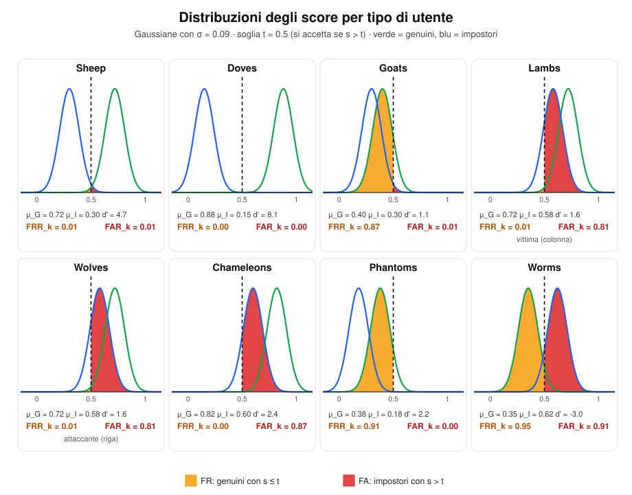

Esempio con $t=0.5$, $\sigma=0.09$ e valori illustrativi:

| Animale | $\mu_G$ | $\mu_I$ | $d'$ | $FRR_k$ | $FAR_k$ | Lettura |
|---|---|---|---|---|---|---|
| Sheep | 0.72 | 0.30 | 4.7 | 0.01 | 0.01 | tutto nella norma |
| Doves | 0.88 | 0.15 | 8.1 | ≈ 0 | ≈ 0 | quasi nessun errore |
| Goats | 0.40 | 0.30 | 1.1 | **0.87** | 0.01 | molti FR, FA normali |
| Lambs | 0.72 | 0.58 (vittima) | 1.6 | 0.01 | **0.81** | molti FA *contro* di loro |
| Wolves | 0.72 | 0.58 (attaccante) | 1.6 | 0.01 | **0.81** | causano FA verso gli altri |
| Chameleons | 0.82 | 0.60 | 2.4 | ≈ 0 | **0.87** | niente FR, ma tanti FA |
| Phantoms | 0.38 | 0.18 | 2.2 | **0.91** | ≈ 0 | tutti i genuini respinti, nessun FA |
| Worms | 0.35 | 0.62 | −3.0 | **0.95** | **0.91** | falliscono su entrambi i fronti |

> Nota: i valori di $FAR_k$ per Lambs e Wolves sono *per interazione*: il lamb subisce gli attacchi, il wolf li produce. Nel conteggio globale i due contribuiscono alla stessa cella della matrice, ma si individuano guardando **colonna** vs **riga**.

### 11.5 Cosa cambia in pratica

- **Aggiungere la soglia non risolve il problema**: abbassare $t$ aiuta capre e phantoms (meno FR) ma peggiora lambs, wolves e chameleons (più FA).
- **Gli animali "peggiori" sono pochi ma pesano molto**: per questo si riportano anche le prestazioni per utente (o percentili), non solo la media.
- **Rimedi tipici**: normalizzazione degli score *per utente* (z-norm, t-norm), soglie utente-specifiche, enrollment multiplo (più template → meno capre), fusione multimodale.
  
---

## 12. Decidability Value

Misura alternativa (usata nelle competizioni di iris recognition) che tiene conto insieme dei contributi di FA e FR.

Si costruiscono due insiemi di distanze: **D^I** (intra-class, stesso soggetto) e **D^E** (inter-class, soggetti diversi).

$$
\text{Decidability} = \frac{\overline{D^E} - \overline{D^I}}{\sigma}
$$

dove σ è una misura di deviazione standard normalizzante calcolata sui due insiemi.

---

## 13. Reliability of an Identification System (SRR)

La **reliability** di una singola risposta è diversa dall'accuratezza globale del sistema (FAR/FRR/CMS): riguarda **quanto ci si può fidare di una specifica decisione**.

### 13.1 Catena logica
1. Valutare la **qualità della probe** prima del riconoscimento (pre-processing).
2. Eseguire il riconoscimento.
3. Valutare la **reliability della risposta** dopo il riconoscimento.

### 13.2 Misure di qualità dell'immagine (esempio volto)

- **SP (Score Pose):**
$$
SP = \alpha\cdot(1-\text{roll}) + \beta\cdot(1-\text{yaw}) + \gamma\cdot(1-\text{pitch})
$$
  - **Roll** = rotazione attorno all'asse x (facile da correggere: angolo tra i centri degli occhi).
  - **Yaw** = rotazione attorno all'asse z (si perde parte del volto; corregibile solo se moderato, tramite simmetria dₗ vs dᵣ).
  - **Pitch** = rotazione attorno all'asse y (difficile da correggere, basata sul rapporto tra distanza occhi-naso e naso-mento).

- **SI (omogeneità dei livelli di grigio):**
$$
SI = 1 - F(\text{std}(mc))
$$

- **SY (simmetria del volto):**
$$
SY = \sum_{(i,j)\in X} sym(P_i, P_j)
$$

Una buona misura di qualità deve **ridurre l'EER scartando il minor numero possibile** di campioni (bilanciare accuratezza e throughput del sistema).

### 13.3 System Response Reliability (SRR)

Indice **srr ∈ [0,1]** che misura la capacità di separare genuini da impostori **su base di singola probe**, sfruttando la nozione di "confusione" tra i candidati nella lista ordinata.

**Relative Distance:**

$$
\varphi(p) = \frac{F\big(d(p,g_{i_2})\big) - F\big(d(p,g_{i_1})\big)}{F\big(d(p,g_{i_{|G|}})\big)}
$$

- Numeratore: differenza tra la prima e la seconda distanza (quanto sono vicini i primi due candidati).
- Denominatore: distanza massima nella lista.
- **Più basso è φ, peggiore è l'affidabilità** (i primi due candidati sono troppo simili tra loro rispetto alla distanza massima).

**Density Ratio** (meno sensibile agli outlier, generalmente migliore della Relative Distance):

$$
\varphi(p) = 1 - \frac{|N_b|}{|N|}, \qquad N_b = \{g_{i_k} \in G \mid F(d(p,g_{i_k})) < 2\cdot F(d(p,g_{i_1}))\}
$$

Conta quanti template hanno distanza dalla probe inferiore al doppio della prima distanza (nube di candidati "vicini" al primo). **Nube meno affollata → maggiore affidabilità → φ più alto è meglio.**

**Valore critico φₖ:** soglia (analoga concettualmente all'EER) che separa risposte affidabili da non affidabili, minimizzando le stime errate di φ.

**Normalizzazione finale (SRR):**

$$
S(\varphi(p), \overline{\varphi}) =
\begin{cases}
1 - \overline{\varphi} & \text{se } \varphi(p) > \overline{\varphi} \\
\overline{\varphi} & \text{altrimenti}
\end{cases}
$$

$$
SRR = \frac{\varphi(p) - \overline{\varphi}}{S(\overline{\varphi})}
$$

Con **due soglie** finali nel sistema: una per l'accettazione (FAR/FRR) e una per la reliability della risposta — quest'ultima permette di **rifiutare un'identificazione anche se formalmente accettata**, se non ritenuta affidabile.

### 13.4 Stima automatica della soglia di reliability (th)

Il **reliability threshold** ($th$) può essere stimato automaticamente sfruttando un certo numero $M$ di osservazioni successive dello stesso soggetto (es. $M$ frame consecutivi di un video, o $M$ acquisizioni ripetute). Si vuole una soglia che rifletta un compromesso tra due esigenze:

- **Media alta** dei valori di SRR osservati → il sistema è generalmente affidabile.
- **Varianza bassa** → il sistema è stabile (le risposte non oscillano troppo tra affidabili e non affidabili).

Per l'i-esimo soggetto/serie di osservazioni $S_i$, la soglia si stima come:

$$
th_i = \frac{\left|\, E[\overline{S_i}]^2 - \sigma[\overline{S_i}] \,\right|}{E[\overline{S_i}]}
$$

dove:
- $E[\overline{S_i}]$ è la **media** dei valori di reliability osservati sulle $M$ osservazioni;
- $\sigma[\overline{S_i}]$ è la loro **deviazione standard (varianza)**.

> Intuizione: il numeratore penalizza sia una media bassa (poco affidabile) sia un'alta variabilità (poco stabile); dividere per la media normalizza il risultato. Una soglia $th_i$ così calcolata si adatta automaticamente al comportamento tipico di quel soggetto/sistema, invece di usare un valore fisso globale.

---

## 14. Metrica delle distanze — proprietà formali

Una **metrica** su un insieme X è una funzione `d: X × X → ℝ` che soddisfa, per ogni x, y, z ∈ X:

1. **Non negatività (separazione):** d(x,y) ≥ 0
2. **Identità degli indiscernibili:** d(x,y) = 0 ⟺ x = y
3. **Simmetria:** d(x,y) = d(y,x)
4. **Disuguaglianza triangolare:** d(x,z) ≤ d(x,y) + d(y,z)

Una **semimetrica** soddisfa solo le prime 3 proprietà (non necessariamente la disuguaglianza triangolare) — è il caso tipico delle matrici di distanza biometriche, che sono **simmetriche con diagonale nulla**.

Una misura non simmetrica può essere resa simmetrica calcolando la media nelle due direzioni:
$$
d_{sym}(A,B) = \frac{d(A,B) + d(B,A)}{2}
$$

---

## 15. Considerazioni per un confronto affidabile tra sistemi

Per confrontare sistemi in modo equo bisogna considerare:
- Numero e caratteristiche dei dataset usati
- Dimensione delle immagini (risoluzione)
- Dimensione relativa di probe e gallery
- Quantità/qualità delle variazioni tollerate
- Interoperabilità (generalizzazione cross-dataset)

> I dataset pubblici sono stati fondamentali per il progresso della ricerca (misurare e confrontare algoritmi in modo equo), ma rischiano di diventare "mondi chiusi" che restringono la ricerca a battere un singolo numero di benchmark, perdendo di vista lo scopo originale (citando Torralba).

I FoM (**Figures of Merit**: FAR, FRR, EER, ROC, CMS, ecc.) sono misure **ex-post**, legate al dataset/ground truth usato: nel mondo reale il contesto operativo può cambiare (utenti non familiari col sistema, condizioni diverse), quindi la distribuzione degli score può variare.

---

## 16. Aggiornamento del template (Template Update)

Per migliorare l'affidabilità nel tempo:
- Aggiungere nuovi template in gallery quando il riconoscimento è affidabile (mantenendo anche i vecchi → utile contro le intra-class variation).
- Necessario in caso di **invecchiamento** del tratto biometrico.
- Gestione delle nuove tecnologie (es. sensori a risoluzione più alta).
- Modalità: **Supervised** (un operatore conferma) o **Semi-Supervised** (automatica, tramite confronto statistico).
- Selezione dei template più rappresentativi: **Online** (appena arrivano nuovi dati) o **Offline** (dopo un certo periodo di raccolta).

---

## 17. Approfondimenti e domande frequenti aggiuntive

### 17.1 Come scegliere il sistema migliore tra due candidati?

- **A parità di FAR:** si sceglie il sistema con il **FRR inferiore** a quella stessa soglia (più utenti genuini vengono accettati, GAR più alto).
- **A parità di FRR:** si sceglie il sistema con il **FAR inferiore** (maggiore sicurezza contro gli impostori).
- **In senso globale (nessun vincolo di parità):** si confronta l'**AUC** delle rispettive curve ROC. Si seleziona il sistema con l'AUC maggiore, perché indica prestazioni complessivamente migliori su tutto il range di soglie possibili.

### 17.2 Detection Rate vs Identification Rate

- **Detection Rate (DR):** probabilità che un soggetto genuino venga **rilevato come presente** in gallery (il sistema capisce "è uno dei nostri"). Nell'open set coincide con $DIR(t,1)$ considerato come semplice "detezione" (senza guardare se l'identità restituita è esatta).
- **Identification Rate (IR):** probabilità che un soggetto genuino venga **correttamente identificato**, cioè che il sistema scelga proprio l'identità giusta. Nel closed set corrisponde al Rank-1 Identification Rate, cioè $CMS(1)$.

> La distinzione è utile perché nel closed set il problema è solo "trovare chi è" (esiste solo detezione implicita, dato che tutti sono in gallery), mentre nell'open set c'è anche il problema preliminare di "riconoscere se il soggetto appartiene al sistema" prima ancora di provare a identificarlo.

### 17.3 Perché l'accuracy "classica" del Machine Learning non basta?

Se si calcolassero i tassi di errore dividendo semplicemente per il **numero totale di probe** (come fa l'accuracy standard in ML), si otterrebbe un valore che **nasconde comportamenti critici asimmetrici**. 

**Esempio:** un sistema può mostrare un'accuracy dell'80% pur accettando il 100% degli impostori (FAR = 1, gravissimo per la sicurezza) oppure rifiutando il 100% degli utenti legittimi (FRR = 1, sistema inutilizzabile). L'accuracy aggrega tutto in un unico numero medio e può mascherare uno dei due errori. Le metriche biometriche FAR/FRR, invece, **separano sempre genuini e impostori**, rendendo visibile ogni comportamento anomalo.

### 17.4 FAR/FRR vs Precision/Recall (confronto con le metriche ML)

Le metriche ML classiche si basano sui **risultati corretti** (veri positivi):

$$
Precision = \frac{TP}{TP+FP} = \frac{GA}{GA+FA}
\qquad\qquad
Recall = \frac{TP}{TP+FN} = \frac{GA}{GA+FR}
$$

Le metriche biometriche si basano invece sugli **errori**, sempre separati per categoria di utente:

$$
FRR = \frac{FR}{GA+FR} = \frac{FN}{TP+FN}
\qquad\qquad
FAR = \frac{FA}{FA+GR} = \frac{FP}{FP+TN}
$$

> Le due coppie partono da prospettive opposte e complementari: Precision/Recall valutano **quante risposte positive sono corrette**; FAR/FRR valutano **quanto spesso il sistema sbaglia** su ciascuna categoria di utenti (genuini vs impostori). Per questo in ambito biometrico si preferisce sempre riportare FAR/FRR (o la coppia EER/ROC) piuttosto che una singola accuracy aggregata.

### 17.5 Relazione tra CMC, ROC, FAR e FRR

Bolle et al. (2005) hanno dimostrato un risultato importante: quando un matcher 1:1 viene usato per ordinare i candidati (cioè per costruire la lista ordinata usata nel closed/open set), la **curva CMC è direttamente derivabile da FAR e FRR** — non aggiunge quindi nuova informazione statistica rispetto alla curva ROC, che già mostra il trade-off FAR/FRR al variare della soglia.

> In sintesi: **CMC, ROC, FAR e FRR sono tutte rappresentazioni diverse della stessa informazione**, contenuta a monte nella Distance/Similarity Matrix (DM) calcolata tra probe e gallery. Cambia solo il modo in cui questa informazione viene "letta" e visualizzata (per rango vs per soglia).

### 17.6 Regola pratica sulla soglia di accettazione

La soglia $t$ decide se accettare o respingere un match, e la regola dipende dal tipo di score usato:

- se si usa una **distanza** → si accetta se $\text{distanza} \le t$ (più bassa = più simile);
- se si usa una **similarità** → si accetta se $\text{similarità} \ge t$ (più alta = più simile).

Cambiando $t$, FAR e FRR si muovono sempre in direzioni opposte: soglia più **alta/restrittiva** → FAR minore ma FRR maggiore; soglia più **bassa/permissiva** → FRR minore ma FAR maggiore. Non esiste una soglia "oggettivamente migliore": si sceglie il punto operativo in base al tipo di applicazione (sicurezza vs comodità utente), valutando le prestazioni su una griglia di soglie tramite le curve ROC/DET.

### 17.7 Tabella riassuntiva: Verification vs Closed Set vs Open Set

| Aspetto | Verification (1:1) | Closed Set (1:N) | Open Set (1:N) |
|---|---|---|---|
| Obiettivo | Validare l'identità dichiarata | Trovare l'identità corretta (soggetto sempre registrato) | Rilevare se il soggetto è registrato e, in caso, identificarlo |
| Rivendicazione (claim) | Sì | No | No |
| Impostori possibili | Sì | No | Sì |
| Soglia di accettazione | Sì | No | Sì |
| Errori possibili | GA, FR, GR, FA | Solo False Rejection (rango > 1) | Correct D&I, False Rejection, False Acceptance, Genuine Reject |
| Metriche principali | FAR, FRR, EER, ROC, DET | CMS, CMC, Recognition Rate (RR) | DIR al rango k, FAR, FRR, FNIR/FPIR |

---

## 18. Riepilogo — mappa concettuale delle formule chiave

$$
\boxed{FAR(t) = \frac{FA}{TI}} \qquad
\boxed{FRR(t) = \frac{FR}{TG}} \qquad
\boxed{GAR = \frac{GA}{TG} = 1-FRR} \qquad
\boxed{GRR = \frac{GR}{TI} = 1-FAR}
$$

$$
\boxed{EER: \ FAR(t^*) = FRR(t^*)}
$$

$$
\boxed{DIR(t,1) = \frac{\text{correct detect \& identify a rango 1}}{|P_G|}} \qquad
\boxed{FRR(t) = 1 - DIR(t,1)}
$$

$$
\boxed{CMS(k) = P(\text{identità corretta nei primi } k \text{ posti})}, \quad CMS(1) = \text{Recognition Rate}
$$

**Schema dei task e loro errori possibili:**

| Task | Claim identità | Soglia | Errori possibili |
|---|---|---|---|
| **Verifica** | Sì | Sì | GA, FR, GR, FA |
| **Identificazione Open Set** | No | Sì | Correct D&I, False Rejection, False Acceptance, Genuine Reject |
| **Identificazione Closed Set** | No | No | Solo False Rejection (nessuna FA) |

